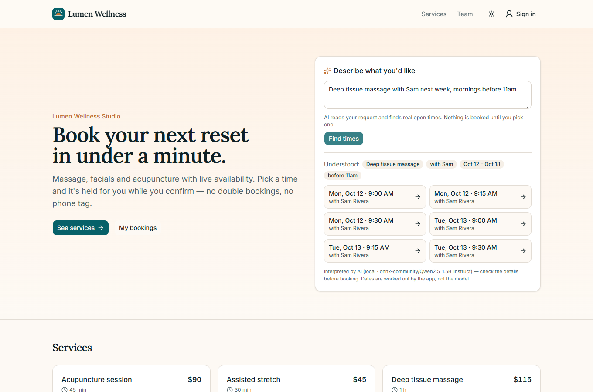
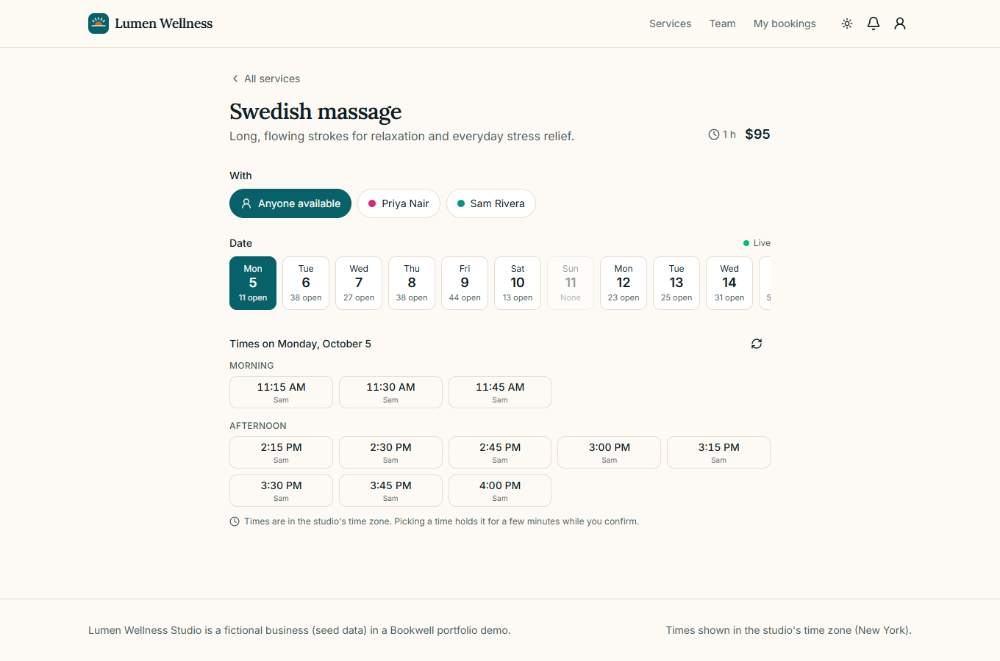
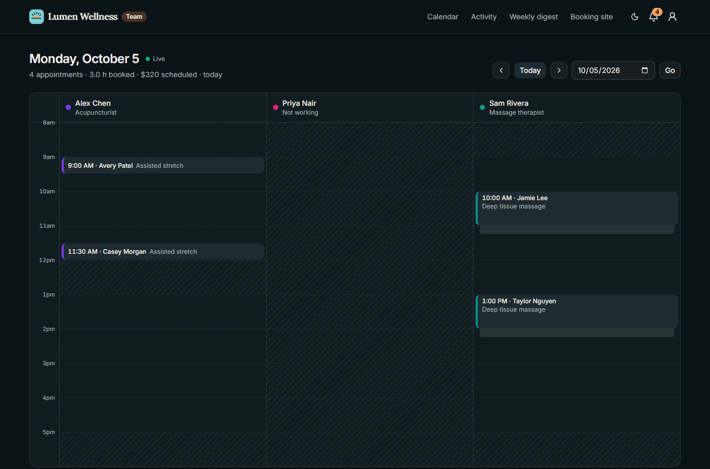
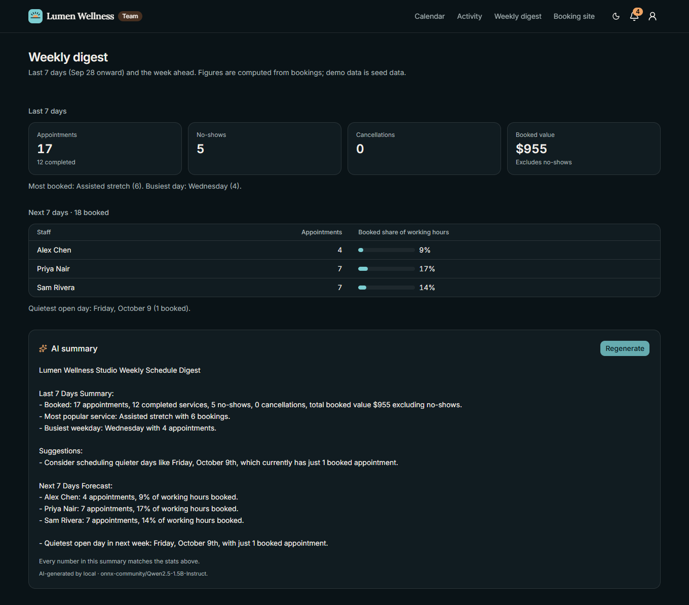
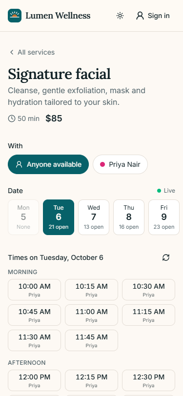
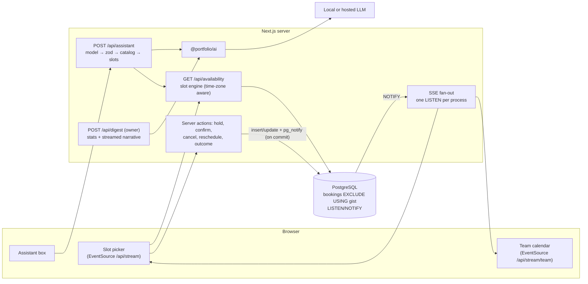

# Bookwell — real-time booking & scheduling

**Online booking for appointment businesses: live availability, slot holds while the customer confirms,
a database that refuses double bookings, a live team calendar, and an assistant that turns "deep tissue with Sam
next Tuesday after 4pm" into real open times.**



> Portfolio project. "Lumen Wellness Studio", its staff, customers and bookings are fictional **seed data**. The AI
> output in the screenshots came from real calls to a local open model (`Qwen2.5-1.5B-Instruct`).

## Contents
[Features](#features) · [Screenshots](#screenshots) · [Quickstart](#quickstart) · [Demo logins](#demo-logins) ·
[Architecture](#architecture) · [Data model](#data-model) · [How double booking is prevented](#how-double-booking-is-prevented) ·
[AI design](#ai-design) · [Quality metrics](#quality-metrics) · [Security](#security-notes) · [Tech stack](#tech-stack) ·
[Environment variables](#environment-variables) · [Limitations](#limitations) · [Licenses](#licenses) ·
[Extending for a client](#how-i-would-extend-this-for-a-client)

## Features
**Customers**
- Pick a service, a staff member (or "anyone available"), a day and a time. Days show how many times are open; times are grouped into morning/afternoon/evening.
- **Live availability over Server-Sent Events**: when someone else books, the time disappears from every open booking page within seconds, with no reload.
- **Hold → confirm**: choosing a time reserves it for 5 minutes (countdown on the page) while the customer adds a note and confirms. One active hold per customer.
- **Clear conflict recovery**: if a time was taken a moment earlier, the customer sees "Sorry — that time was just taken" with the three nearest open times as one-click alternatives.
- My bookings: upcoming and past, **reschedule** (same booking and reference, new time) and **cancel**, both allowed until 60 minutes before the appointment.
- Notifications when the studio cancels or moves a booking.

**Team (owner and staff)**
- **Live day calendar**: one column per staff member, working hours vs. time off, clean-up buffers, held vs. confirmed bookings, a "now" line. It refreshes itself and shows a toast when a booking is made, moved or cancelled.
- Booking detail with history; cancel, reschedule, and mark *completed* / *no-show* once the appointment has started.
- Activity feed and a notification bell.
- **Weekly digest** (owner only): last-7-day and next-7-day numbers computed from the database, plus an AI-written summary.

**AI features**
- **Natural-language booking search**: free text → service, staff and time preference → real open slots from the same availability engine as the booking page. Nothing is booked until the customer picks a time.
- **Weekly digest narrative** with a built-in number check: any number in the AI text that doesn't appear in the computed stats is flagged to the owner.
- Without an AI provider both features show **"AI unavailable"**; booking, availability and the digest numbers keep working.

## Screenshots
| Slot picker (live) | Team calendar (dark) |
|---|---|
|  |  |
| **Weekly digest with number check (dark)** | **Mobile (375 px)** |
|  |  |

## Quickstart
Requirements: Node 22+. No Docker, database server or API key needed.

```bash
npm install                               # from the repository root
npm run setup --workspace apps/booking    # migrate + seed (studio, staff, ~45 bookings around today)
npm run dev --workspace apps/booking      # http://localhost:3004
```

- **AI features:** copy `apps/booking/.env.example` to `.env` and set `AI_LOCAL_MODELS=true` (free, in-process open model, ~1.8 GB download on first use) or a free-tier key (`GROQ_API_KEY`, `GEMINI_API_KEY`, `HF_TOKEN`) or `OLLAMA_BASE_URL`.
- **Postgres instead of PGlite:** `docker compose -f apps/booking/docker-compose.yml up --build`.
- **See the live updates:** open the same booking page in two browsers, pick a time in one, and watch it vanish in the other. Keep `/dashboard` open as the owner to see the calendar update.

## Demo logins
Seed data only; shared public password: **`demo-password-123`**

| Role | Email | Can |
|---|---|---|
| Owner | `owner@bookwell.demo` | team calendar, all bookings, activity, weekly digest |
| Staff (Sam) | `sam@bookwell.demo` | team calendar, booking actions, notifications for their bookings |
| Customer | `customer@bookwell.demo` | book, reschedule, cancel, see notifications |

## Architecture


## Data model
```mermaid
erDiagram
  user ||--o{ bookings : books
  services ||--o{ bookings : "for"
  staff ||--o{ bookings : "with"
  staff ||--o{ staff_services : offers
  services ||--o{ staff_services : "offered by"
  staff ||--o{ availability_rules : "works"
  staff ||--o{ time_off : "is away"
  bookings ||--o{ activity : logs
  user ||--o{ notifications : receives

  business { smallint id PK; text timezone; smallint slot_interval_min; smallint booking_horizon_days; smallint min_notice_min }
  services { uuid id PK; text slug UK; smallint duration_min; smallint buffer_min; int price_cents }
  staff { uuid id PK; text user_id FK; text name; text color }
  availability_rules { uuid id PK; uuid staff_id FK; smallint weekday; smallint start_min; smallint end_min }
  bookings { uuid id PK; text reference UK; uuid staff_id FK; text customer_id FK; timestamptz starts_at; timestamptz ends_at; timestamptz blocked_until; booking_status status; timestamptz hold_expires_at; int version }
```
Plus Better Auth tables, `time_off`, `activity`, `notifications`, `rate_limits` and `ai_usage`. CHECK constraints keep
durations, weekdays, minutes and time ordering valid.

## How double booking is prevented
1. **The database is the guard.** [`0000_init.sql`](drizzle/migrations/0000_init.sql) adds
   `EXCLUDE USING gist (staff_id WITH =, tstzrange(starts_at, blocked_until, '[)') WITH &&) WHERE (status IN ('held','confirmed'))`.
   Two held/confirmed bookings for the same person can't overlap, including the clean-up buffer (`blocked_until`), while back-to-back bookings are allowed (half-open ranges).
2. The slot engine ([`slots.ts`](src/server/scheduling/slots.ts)) computes exactly the same range, so what the UI offers matches what the database accepts. The engine is pure and time-zone aware (`@date-fns/tz`), with tests for DST days (23 h and 25 h).
3. On a race the insert fails with SQLSTATE `23P01`. The app catches it, tries the next free staff member when the customer chose "anyone", and otherwise returns 409 with the nearest alternatives.
4. Cancel, reschedule and outcome updates include the `version` the user saw (**optimistic concurrency**), so a stale tab gets "changed by someone else" instead of overwriting.
5. Holds expire after `HOLD_MINUTES`. Expired holds are ignored by availability and deleted just before the next insert for that staff member, so no cron job is needed.

Tested: a unit test races 4 customers for one slot (exactly 1 wins, 3 get 409 + alternatives), and another inserts overlapping rows directly to prove the constraint. E2E tests cover the stale-tab race in a real browser.

## AI design
**Natural-language search** ([`nl-core.ts`](src/server/ai/nl-core.ts), [`features.ts`](src/server/ai/features.ts))
- The model gets the service list, the staff first names and the customer's text (fenced as untrusted data, max 300 characters). It returns JSON `{service, staff, timeOfDay, after, before}`, validated by zod with a normalizer for small-model quirks and repair turns.
- **Code, not the model, handles exact values:** dates ("next Tuesday", "the 15th", "10/22", "this weekend") are resolved by a deterministic parser in the studio's time zone, and explicit clock times ("after 4pm", "between 2 and 4") by a time parser. Model-invented clock times are dropped when the request contains no time. The resolved range is shown back to the customer.
- **The catalog decides:** the service slug and staff name must exist (and the staff member must offer the service) or they are discarded with an explanation. If the model returns no valid service but the request names exactly one service by a distinctive word ("acupuncture"), that service is used.
- The model never sees the calendar and can't book. Results are real openings; picking one opens the normal booking flow with the time pre-selected.

**Weekly digest** ([`digest-core.ts`](src/server/ai/digest-core.ts))
- Stats are computed in code from the bookings table and passed to the model as plain fact lines. The narrative is streamed, and afterwards every number in it is checked against the stats; mismatches are shown as "Check these numbers". The model sees aggregates only, never customer names or notes.

**Cost & safety:** 10 AI requests/min per user (per IP when signed out), output capped at 120 tokens (search) and 260 (digest), provider timeouts, every call logged to `ai_usage`. The E2E suite uses a labelled stub provider; tests that rely on it say "(stub AI)".

## Quality metrics
Every number comes from a command that was run; raw output in [docs/verification.md](docs/verification.md).

| Metric | Result | Source |
|---|---|---|
| Unit + integration tests | 91 passed | `npm run test:coverage` (Vitest, in-memory PGlite) |
| Line coverage (server + lib) | 90.15% | [`docs/metrics/coverage-summary.json`](docs/metrics/coverage-summary.json) |
| End-to-end tests | 18 passed (book with sign-in, live update across browsers, stale-tab race, reschedule/cancel, live team calendar, assistant, digest + authz, API guards, a11y, 360 px) | `npm run test:e2e` |
| Accessibility (axe-core, WCAG 2 A/AA) | 0 violations on 5 pages, light + dark | `tests/e2e/journey.spec.ts` |
| Lighthouse — home (mobile) | Performance 90 · Accessibility 100 · Best practices 100 · SEO 100 | [`docs/metrics/lighthouse-home.json`](docs/metrics/lighthouse-home.json) |
| Lighthouse — booking page (mobile) | Performance 90 · Accessibility 100 · Best practices 100 · SEO 100 | [`docs/metrics/lighthouse-booking.json`](docs/metrics/lighthouse-booking.json) |
| NL eval: requests fully understood (19 everyday requests) | 89.5% end to end (raw model alone: 57.9%) | `npm run eval` → [`docs/metrics/eval-nl-booking.json`](docs/metrics/eval-nl-booking.json) |
| NL eval: per field (raw model → final) | service 78.9% → 89.5% · staff 100% · time window 73.7% → 100% · dates 100% (deterministic parser) | same |
| NL eval: schema-valid output | 100% (90.9% on the first attempt) | same |
| NL eval: invented services/staff | model 1 of 22 cases (an injected slug); after the catalog resolver 0 | same |
| NL eval: injection attempts (3) | no invented value or action reached the app; expected service in 2 of 3 | same |
| NL eval baseline (first prompt, no code parsing) | all model fields 36.8% · service 68.4% · staff 84.2% · time 63.2% | [`eval-nl-booking.baseline.json`](docs/metrics/eval-nl-booking.baseline.json) |
| Production dependency audit | 0 vulnerabilities | `npm audit --omit=dev` |

The eval runs the production prompt, schema, normalizer and resolvers against a local 1.5B model (median 15 s per
request on this CPU-only machine). It is a small hand-written set, so treat the numbers as indicative only.

## Security notes
- Authorization on every action and route: customers can only see and change their own bookings (others get 404), team pages return 404 to customers, the digest is owner-only, and outcomes are team-only. The `role` field can't be set at sign-up.
- The `exclude` parameter (rescheduling) is honoured only for the booking's owner or the team, so nobody can probe other bookings through availability.
- The public SSE stream carries only `{dates, staffId}`, never references or names. The team stream requires a team session.
- zod on every input; CHECK and exclusion constraints in the database; server actions are origin-checked by Next.js and API POSTs by `assertSameOrigin`; secure headers (CSP, HSTS, nosniff, frame denial); sign-in limited to 5/min per IP; holds limited to 10/min per user; availability limited to 120/min per IP.
- Errors return safe messages with a request id; no stack traces reach the client (tested).

## Tech stack
| Choice | Why |
|---|---|
| Next.js 16 App Router | server-rendered pages, server actions for booking changes, route handlers for SSE |
| PostgreSQL (Drizzle) + btree_gist | exclusion constraint for overlaps, LISTEN/NOTIFY for realtime, one source of truth |
| Server-Sent Events | one-way updates are all the UI needs; proxy-friendly, auto-reconnect, no extra service |
| @date-fns/tz | DST-correct wall-clock ↔ UTC conversion for availability |
| PGlite for dev/tests | real Postgres (WASM) with btree_gist, so tests exercise the actual constraint |
| Lora + Inter (OFL, self-hosted) | calm serif headings for a wellness brand, readable UI face |
| Vitest, Playwright, axe-core | integration tests on a real database, multi-browser E2E and accessibility |

## Environment variables
| Variable | Required | Default | Purpose |
|---|---|---|---|
| `APP_URL` | prod | `http://localhost:3004` | auth origin, canonical URLs, sitemap |
| `DATABASE_URL` / `PGLITE_DIR` | prod / no | PGlite `.data/pglite` | database |
| `BETTER_AUTH_SECRET` | prod | — | session signing |
| `GITHUB_CLIENT_ID` / `GITHUB_CLIENT_SECRET` | no | — | GitHub sign-in |
| `HOLD_MINUTES` | no | `5` | how long a picked slot is held |
| `HOLDS_PER_MINUTE` | no | `10` | slot picks per user per minute |
| `AI_PROVIDER`, `AI_LOCAL_MODELS`, `OLLAMA_*`, `GROQ_*`, `GEMINI_*`, `HF_TOKEN`, `OPENAI_*`, `AI_TIMEOUT_MS` | no | `auto` | AI providers ([`.env.example`](.env.example)) |
| `AI_USER_PER_MINUTE` | no | `10` | assistant/digest requests per user (or IP) per minute |
| `AUTH_SIGNIN_PER_MINUTE` | no | `5` | sign-in attempts per IP per minute |

## Limitations
- **No payments or deposits**: dropped to keep scope tight (Stripe Checkout + webhooks are shown in the storefront app). Bookings say "pay at the studio".
- **One business**: no multi-location or multi-tenant support; services, staff and hours are managed through the seed script, not an admin UI yet.
- No email/SMS reminders; notifications are in-app only.
- The 1.5B local model is slow on CPU (median 15 s per assistant request) and still misses some vague requests ("sports massage", "skin treatment"); a hosted model would likely do better, but that was not measured. The digest narrative can still include unsupported qualitative claims, which the number check doesn't catch.
- Realtime with PGlite works within one process; across several server instances it relies on Postgres LISTEN/NOTIFY, which is covered by the CI job but **was not run on this machine** (no Docker/Postgres). Docker/compose were written but not run here either.

## Licenses
| Asset | Source | License |
|---|---|---|
| Qwen2.5-1.5B-Instruct (ONNX) | huggingface.co/onnx-community/Qwen2.5-1.5B-Instruct | Apache-2.0 |
| Lora, Inter, Geist Mono fonts | self-hosted from [`packages/ui/fonts`](../../packages/ui/fonts) (Fontsource 5.3.0 variable builds of the Google Fonts releases) via `next/font/local` | SIL Open Font License 1.1 |
| Logo (sun over horizon) | drawn as inline SVG for this project | same as this repo |
| Lucide icons / shadcn/ui | lucide.dev / ui.shadcn.com | ISC / MIT |
| Studio, staff, customers, bookings | written for this project; fictional seed data | same as this repo |

## How I would extend this for a client
- Admin UI for services, prices, weekly hours and time off; multiple locations and rooms/equipment as bookable resources (same exclusion-constraint pattern).
- Deposits or card-on-file with Stripe, a no-show fee policy, and packages/memberships.
- Email/SMS confirmations and reminders (with ICS attachments), waitlist offers when a slot frees up, Google/Outlook calendar sync for staff.
- An embeddable booking widget for the client's existing website and a public API.
- The assistant on WhatsApp/SMS using the same parse → validate → search pipeline, with a hosted model for better recall.
