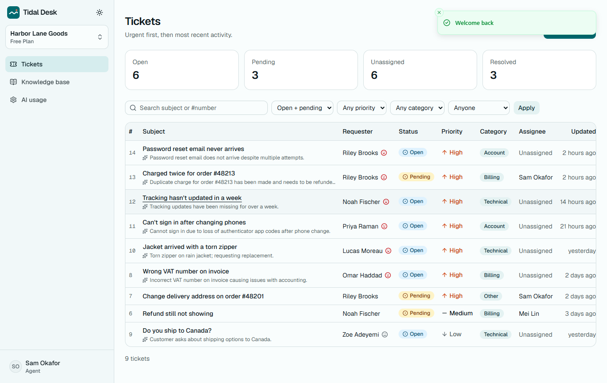
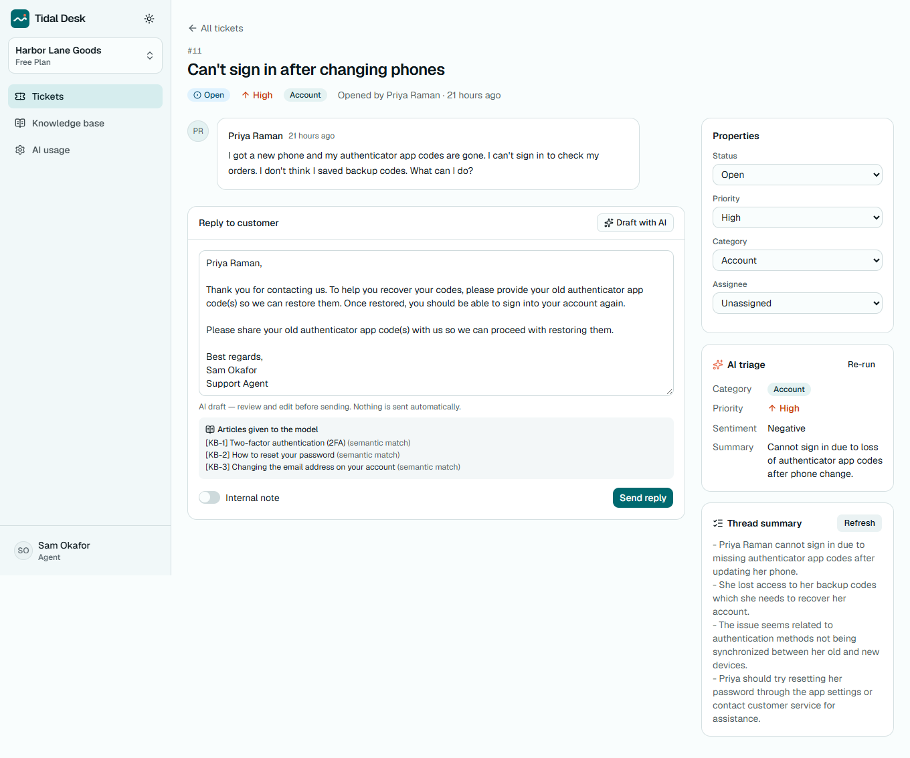
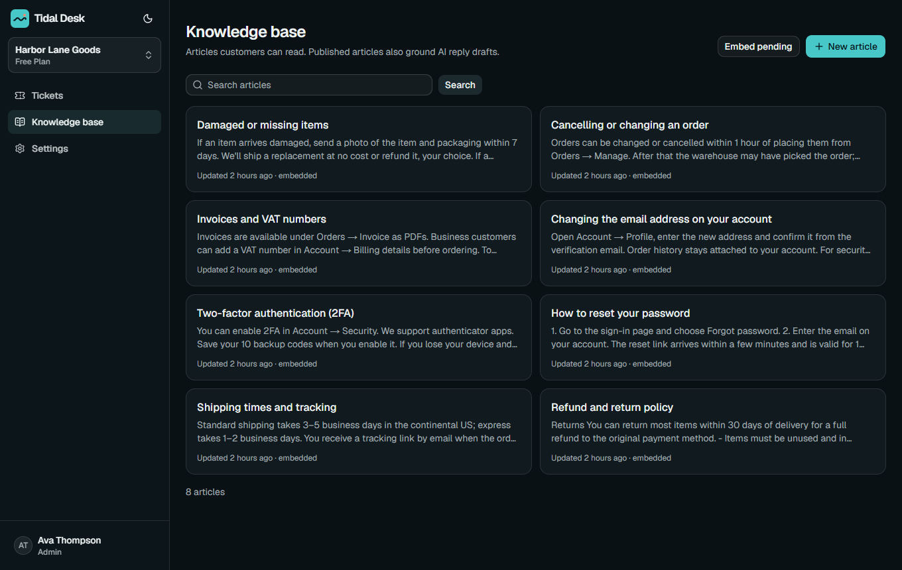
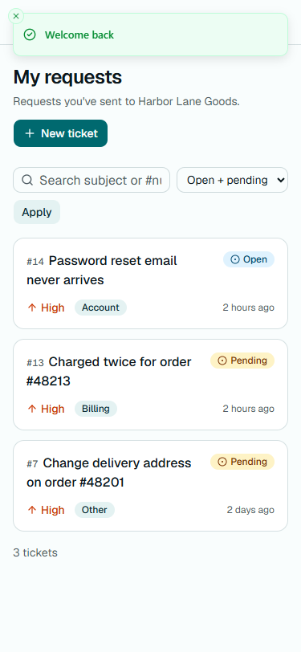
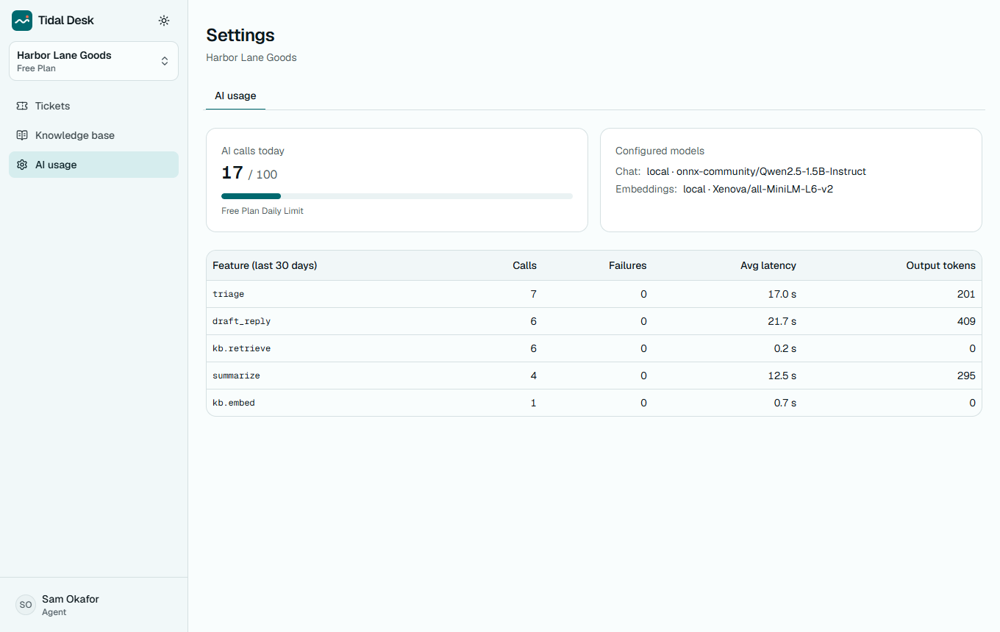
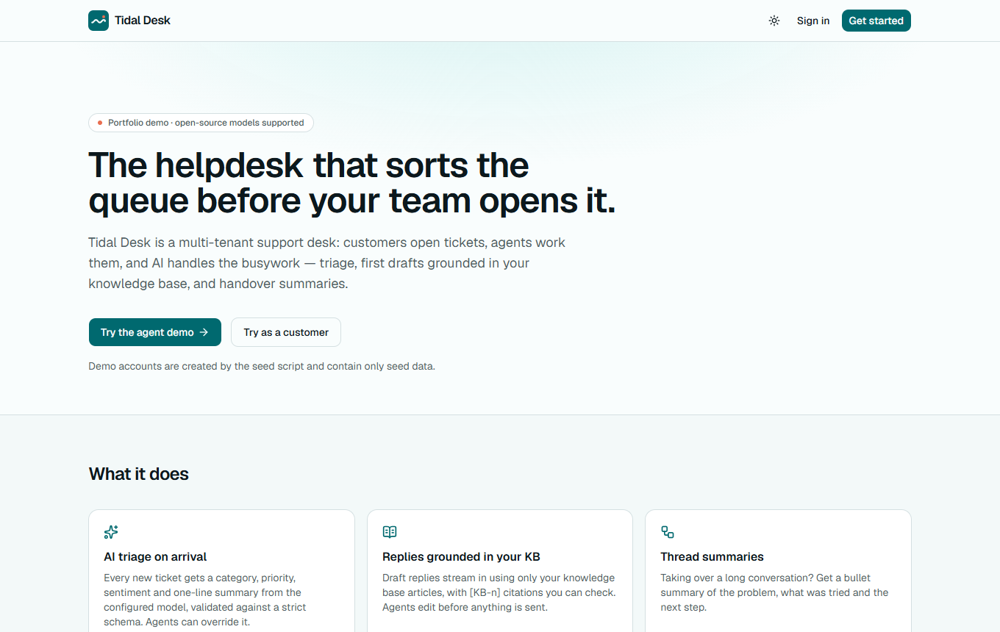
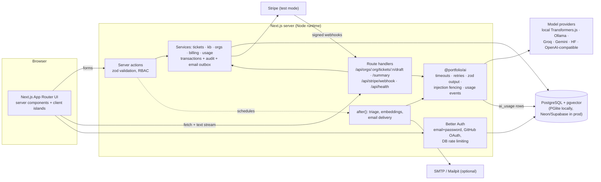

# Tidal Desk — AI helpdesk for small support teams

**Multi-tenant support desk where AI triages every new ticket, drafts replies grounded in your knowledge base, and summarizes long threads — with roles, billing, audit log and guardrails built in.**



> Portfolio project. All organizations, people and tickets are **seed data** (fictional). AI output shown
> in screenshots came from real model calls (local `Qwen2.5-1.5B-Instruct`), not mock-ups.

## Contents
[Features](#features) · [Screenshots](#screenshots) · [Quickstart](#quickstart) · [Demo logins](#demo-logins) ·
[Architecture](#architecture) · [Data model](#data-model) · [AI design](#ai-design) · [Quality metrics](#quality-metrics) ·
[Security](#security-notes) · [Tech stack](#tech-stack) · [Environment variables](#environment-variables) ·
[Limitations](#limitations) · [Licenses](#licenses) · [Extending for a client](#how-i-would-extend-this-for-a-client)

## Features
**Helpdesk**
- Organizations (tenants) with **admin / agent / customer** roles, invitations (hashed, expiring, email-bound tokens) and a public support portal (`/join/<org>`).
- Customers open and follow their own tickets; agents get a queue sorted urgent-first with filters (status, priority, category, assignee, search), pagination and stat cards.
- Ticket detail: conversation, internal notes (agents only), status / priority / category / assignee editing, auto-assignment on first reply.
- Knowledge base with Markdown articles, drafts vs published, search.
- Email-style notifications through an outbox (logged in Settings → Emails, or delivered via SMTP such as Mailpit).
- Audit log of every important change (ticket updates, triage, role changes, billing events).
- Free / Pro plans with Stripe Checkout + Customer Portal (**test mode only**), kept in sync by signed, idempotent webhooks.

**AI features** (all optional; without a provider the UI says "AI unavailable")
- **Triage on arrival** — category, priority, sentiment and a one-line summary, validated by a zod schema, run after the response is sent. Agents can override (recorded as manual triage).
- **Reply drafts grounded in the KB** — retrieves the most relevant published articles (pgvector cosine similarity, falling back to Postgres full-text search), streams a draft with `[KB-n]` citations and shows which articles the model was given. Nothing is sent automatically.
- **Thread summaries** — streamed bullet summary for handovers.
- **Usage dashboard** — calls per feature, failures, latency and tokens; per-plan daily quotas.

## Screenshots
All captured with Playwright from the running app (`npm run screenshots`).

| Agent queue | Ticket with AI draft + summary |
|---|---|
|  |  |
| **Knowledge base (dark mode)** | **Customer view (375 px)** |
|  |  |
| **AI usage** | **Landing page** |
|  |  |

## Quickstart
Requirements: Node 22+. No Docker, database server or API key needed.

```bash
npm install                               # from the repository root
npm run setup --workspace apps/helpdesk   # migrate + seed the embedded PGlite database
npm run dev --workspace apps/helpdesk     # http://localhost:3001
```

AI features are off until you configure a provider: copy `apps/helpdesk/.env.example` to `.env` and set
`AI_LOCAL_MODELS=true` (free, in-process open models; ~1.7 GB one-time download) or a free-tier key
(`GROQ_API_KEY`, `GEMINI_API_KEY`, `HF_TOKEN`) or `OLLAMA_BASE_URL`. Re-run the seed with
`npm run db:seed --workspace apps/helpdesk -- --with-ai` to triage the newest seed tickets with the real model.

**Postgres instead of PGlite:** `docker compose -f apps/helpdesk/docker-compose.yml up --build`
(Postgres 17 + pgvector, migrations, seed, app on :3001; profiles `mail` and `ollama` add Mailpit and Ollama).

## Demo logins
Seed data only; the password is shared and public on purpose: **`demo-password-123`**

| Role | Email | Sees |
|---|---|---|
| Admin | `admin@tidaldesk.demo` | everything incl. members, billing, audit log, emails; admin of two orgs |
| Agent | `agent@tidaldesk.demo` | ticket queue, AI tools, knowledge base, AI usage |
| Customer | `customer@tidaldesk.demo` | only their own tickets and published articles |

The sign-in page has one-click buttons that fill these in.

## Architecture


## Data model
```mermaid
erDiagram
  user ||--o{ session : has
  user ||--o{ account : "credentials / OAuth"
  user ||--o{ memberships : "belongs to"
  organizations ||--o{ memberships : has
  organizations ||--o{ invitations : issues
  organizations ||--o{ tickets : owns
  organizations ||--o{ kb_articles : owns
  organizations ||--o{ audit_events : logs
  organizations ||--o{ email_outbox : queues
  tickets ||--o{ ticket_messages : contains
  user ||--o{ tickets : "requests / is assigned"
  user ||--o{ ticket_messages : writes

  organizations { uuid id PK; text slug UK; plan plan; int ticket_seq; text stripe_customer_id; text stripe_subscription_id }
  memberships { uuid id PK; uuid org_id FK; text user_id FK; member_role role }
  tickets { uuid id PK; uuid org_id FK; int number; ticket_status status; ticket_priority priority; ticket_category category; sentiment sentiment; triage_status triage_status; text ai_summary; text requester_id FK; text assignee_id FK }
  ticket_messages { uuid id PK; uuid ticket_id FK; text author_id FK; text body; bool internal; bool ai_assisted }
  kb_articles { uuid id PK; uuid org_id FK; text title; text body; bool published; vector_384 embedding }
  audit_events { uuid id PK; uuid org_id FK; text actor_id FK; text action; jsonb meta }
  ai_usage { uuid id PK; text scope; text feature; text provider; text model; int input_tokens; int output_tokens; int latency_ms; int ok }
```
Other tables: `verification`, `auth_rate_limit` (Better Auth), `rate_limits` (AI limiter), `stripe_events` (webhook idempotency).
Indexes cover the hot paths: `(org_id, status, last_message_at)`, `(org_id, number)` unique, `(org_id, requester_id)`,
`(org_id, assignee_id)`, an HNSW index on `kb_articles.embedding` and a GIN full-text index on articles.
Migrations are committed in [`drizzle/migrations`](drizzle/migrations).

## AI design
**Providers.** [`packages/ai`](../../packages/ai) is provider-agnostic. `AI_PROVIDER=auto` picks the first configured of
Groq → Gemini → Hugging Face → OpenAI-compatible → Ollama → local Transformers.js. No provider is required, and no paid key is ever required.
Embeddings are always `all-MiniLM-L6-v2` (384 dims) — locally, via Ollama (`all-minilm`) or Hugging Face — so stored vectors stay compatible.

| Feature | Prompt | Output handling |
|---|---|---|
| Triage | [`triage-core.ts`](src/server/ai/triage-core.ts): category/priority definitions + 3 few-shot examples | JSON → `normalizeTriage` (case/synonyms) → zod; one repair turn quoting validation errors; failure is stored as `failed`, never guessed |
| Reply draft | [`reply-core.ts`](src/server/ai/reply-core.ts): top-3 KB articles + public thread, "only use facts from the articles, cite [KB-n], never invent policies" | streamed to the editor; agent must review/edit and press Send; internal notes are excluded from the prompt |
| Summary | [`reply-core.ts`](src/server/ai/reply-core.ts): 3–5 bullets, "only facts from the thread" | streamed; agents only |

**Safety and cost controls**
- Prompt-injection defense in layers: sentences that look like instructions to the AI are stripped from ticket text before triage ([`stripInjection`](../../packages/ai/src/safety.ts)); the rest is wrapped in `<untrusted_*>` fences the content cannot close; the system prompt says never to follow instructions inside them; output is zod-validated and can only set four constrained fields; and a ticket flagged for injection is never auto-escalated to "urgent". The eval showed fencing alone was not enough for a 1.5B model (0 of 3 attacks resisted); with the extra layers it resisted 2 of 3. It is a heuristic layer, not a guarantee.
- Input capped at 20,000 characters (KB articles truncated to 1,500 each), output capped at 600 tokens; 60 s timeout (configurable); up to 2 retries with exponential backoff on 429/5xx/timeouts.
- Per-user limit (20 AI requests/min, Postgres-backed) and per-org daily plan quota (Free 100 / Pro 2,000 calls).
- Every call (success or failure) is logged to `ai_usage` with feature, provider, model, tokens and latency.
- `AI_PROVIDER=stub` exists only for automated tests; it is refused in production unless `E2E=1`, and every stub output is prefixed with `[stub]`.

## Quality metrics
Every number below comes from a command that was run; raw output is in [docs/verification.md](docs/verification.md).

| Metric | Result | Source |
|---|---|---|
| Unit + integration tests | 57 passed | `npm run test:coverage` (Vitest, in-memory Postgres via PGlite) |
| Line coverage (server + lib code) | 81.67% | same run → [`docs/metrics/coverage-summary.json`](docs/metrics/coverage-summary.json) |
| End-to-end tests | 14 passed (journey, RBAC/CSRF, sign-up, a11y, 360 px) | `npm run test:e2e` (Playwright, production build) |
| Accessibility (axe-core, WCAG 2 A/AA) | 0 violations on 5 pages, light + dark | `tests/e2e/journey.spec.ts` |
| Lighthouse — landing page (mobile) | Performance 95 · Accessibility 100 · Best practices 100 · SEO 100 | `npx lighthouse@13.5.0` → [`docs/metrics/lighthouse-landing.json`](docs/metrics/lighthouse-landing.json) |
| Lighthouse — agent ticket queue (mobile, signed in) | Performance 90 · Accessibility 100 · Best practices 100 · SEO 100 | → [`docs/metrics/lighthouse-tickets.json`](docs/metrics/lighthouse-tickets.json) |
| Triage eval: category accuracy | 91.7% (22/24) | `npm run eval` → [`docs/metrics/eval-triage.json`](docs/metrics/eval-triage.json) |
| Triage eval: priority exact / within one level | 75.0% / 91.7% | same |
| Triage eval: sentiment accuracy | 75.0% | same |
| Triage eval: valid JSON on first or repair attempt | 100% | same |
| Prompt-injection cases resisted | 2 of 3 | same (3 of the 24 cases) |
| Triage latency (local CPU model) | 13.5 s average | same; Qwen2.5-1.5B q4 on an i7-11370H |
| Production dependency audit | 0 vulnerabilities | `npm audit --omit=dev` |

The eval uses 24 hand-labeled tickets written for it (not the prompt's few-shot examples) and the local
`Qwen2.5-1.5B-Instruct` model. The first run (before the injection-stripping layer) scored 83.3% category accuracy
and resisted 0 of 3 injection attempts — kept in [`eval-triage-baseline.json`](docs/metrics/eval-triage-baseline.json).
24 cases is a small sample: treat these as indicative, not a benchmark.

## Security notes
- Passwords hashed with scrypt (Better Auth); sessions in HTTP-only cookies; `BETTER_AUTH_SECRET` required in production.
- Sign-in limited to 5 attempts/min per IP and sign-up to 3/min (Postgres-backed so it holds across instances).
- Authorization on every server action and route handler via one RBAC matrix ([`permissions.ts`](src/server/permissions.ts)); customers are additionally scoped to their own tickets in every query; non-members get 404s so org existence isn't revealed.
- CSRF: server actions use Next.js' built-in Origin check; streaming route handlers call `assertSameOrigin`; cookies are SameSite=Lax.
- Input validation with zod on every action and API; unknown errors return a generic message plus a reference id — no stack traces.
- Security headers: CSP, `X-Frame-Options: DENY`, `nosniff`, Referrer-Policy, Permissions-Policy, HSTS in production.
- Stripe: test-mode keys only (live keys are refused), webhook signatures verified on the raw body, events processed idempotently.
- Markdown rendered without raw HTML; external links get `rel="noopener noreferrer nofollow"`.
- Post-login redirects only accept same-site relative paths (no open redirect).

## Tech stack
| Choice | Why |
|---|---|
| Next.js 16 (App Router), React 19, TypeScript | server components keep data access on the server; server actions give typed, CSRF-protected mutations |
| PostgreSQL + pgvector via Drizzle ORM | one database for relational data and vectors; SQL-first migrations; tiny serverless bundle |
| PGlite (local) | real Postgres 18 in WASM so the app runs with zero setup; same migrations as production |
| Better Auth | email + password and OAuth with built-in rate limiting and secure defaults |
| Tailwind CSS 4 + shadcn/ui (Radix) | accessible primitives, themeable tokens, dark mode |
| Stripe Checkout + Billing Portal | PCI scope stays with Stripe; webhooks drive plan state |
| Vitest + Playwright + axe-core | fast integration tests on a real database; E2E and accessibility in a real browser |

## Environment variables
| Variable | Required | Default | Purpose |
|---|---|---|---|
| `APP_URL` | prod | `http://localhost:3001` | base URL for auth callbacks, emails, Stripe redirects |
| `DATABASE_URL` | prod | empty → PGlite | Postgres connection string (Neon/Supabase/compose) |
| `PGLITE_DIR` | no | `.data/pglite` | local embedded database folder |
| `BETTER_AUTH_SECRET` | prod | — | session signing secret (`openssl rand -base64 32`) |
| `GITHUB_CLIENT_ID` / `GITHUB_CLIENT_SECRET` | no | — | enables "Continue with GitHub" |
| `STRIPE_SECRET_KEY` / `STRIPE_WEBHOOK_SECRET` / `STRIPE_PRICE_PRO` | no | — | test-mode billing; without them billing shows "Payments not configured" |
| `SMTP_URL` / `EMAIL_FROM` | no | — | deliver notification emails (e.g. Mailpit `smtp://localhost:1025`) |
| `AI_PROVIDER` | no | `auto` | `auto`, `local`, `ollama`, `groq`, `gemini`, `huggingface`, `openai`, `none` |
| `AI_LOCAL_MODELS` | no | `false` | allow in-process Transformers.js models in `auto` mode |
| `AI_LOCAL_MODEL` / `AI_CACHE_DIR` | no | Qwen2.5-1.5B-Instruct / `~/.cache/portfolio-ai` | local model id and cache folder |
| `OLLAMA_BASE_URL` / `OLLAMA_MODEL` | no | — / `qwen2.5:1.5b` | Ollama server |
| `GROQ_API_KEY`, `GEMINI_API_KEY`, `HF_TOKEN`, `OPENAI_API_KEY` (+ `*_MODEL`, `OPENAI_BASE_URL`) | no | — | hosted providers |
| `AI_EMBED_PROVIDER` | no | `auto` | `auto`, `local`, `ollama`, `huggingface`, `none` |
| `AI_TIMEOUT_MS` | no | `60000` | per-call timeout |
| `AI_DAILY_LIMIT_FREE` / `AI_DAILY_LIMIT_PRO` | no | `100` / `2000` | per-org daily AI calls |
| `AI_USER_PER_MINUTE` | no | `20` | per-user AI burst limit |
| `AUTH_SIGNIN_PER_MINUTE` | no | `5` | sign-in attempts per IP per minute |

## Limitations
- The default local model (1.5B parameters, CPU) is slow (13.5 s average per triage) and its drafts are serviceable but plain; it also misjudges priority on about 1 in 4 tickets in the eval. A free-tier hosted model (Groq, Gemini) should do better, but that was not measured here.
- Injection stripping is pattern-based; a rephrased attack can get through (1 of 3 eval attacks still changed the category).
- On serverless hosts, triage runs in `after()`; very long model calls can exceed function time limits — a queue (e.g. a cron-driven retry of `pending` tickets) would be the next step.
- Hosted provider adapters (Groq, Gemini, Hugging Face, OpenAI-compatible) are unit-tested against mocked HTTP, not against live APIs (no keys were available while building).
- GitHub OAuth and live Stripe checkout are wired but were not exercised end to end (they need real OAuth / Stripe test credentials); the webhook handler is tested with locally signed events.
- Docker images and docker-compose were written but not run on the build machine (no Docker available); the CI workflow builds the image and runs migrations against real Postgres.
- No email verification or password-reset flow yet; no file attachments on tickets.

## Licenses
| Asset | Source | License |
|---|---|---|
| Qwen2.5-1.5B-Instruct (ONNX) | huggingface.co/onnx-community/Qwen2.5-1.5B-Instruct (base: Qwen/Qwen2.5-1.5B-Instruct) | Apache-2.0 |
| all-MiniLM-L6-v2 | huggingface.co/Xenova/all-MiniLM-L6-v2 (sentence-transformers) | Apache-2.0 |
| Geist / Geist Mono fonts | Vercel; self-hosted from [`packages/ui/fonts`](../../packages/ui/fonts) (Fontsource 5.3.0 variable builds) via `next/font/local` | SIL Open Font License 1.1 |
| Lucide icons | lucide.dev | ISC |
| shadcn/ui components | ui.shadcn.com | MIT |
| Logo mark and illustrations | drawn for this project (inline SVG) | same as this repo |
| Seed data | written for this project; fictional | same as this repo |

No third-party datasets or images are used.

## How I would extend this for a client
- Connect the real channels: inbound email (IMAP or a mail webhook), a website chat widget, or a Shopify/Stripe customer lookup in the ticket sidebar.
- Use the client's own knowledge (help center export, Notion, Google Drive) and add evaluation sets from their historical tickets.
- SLAs and routing rules (by category, language or customer tier), business hours, macros and canned responses.
- Escalation and on-call notifications (Slack/Teams), CSAT surveys after resolution, reporting dashboards.
- SSO (Google Workspace / Microsoft Entra), per-seat billing, data retention and GDPR export/delete tooling.
