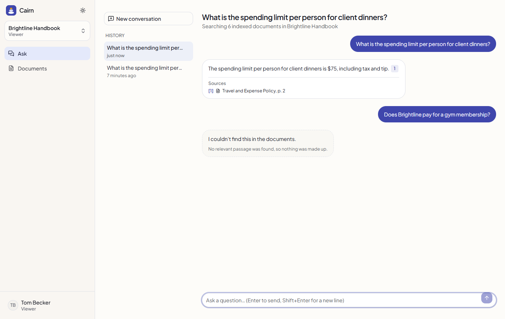
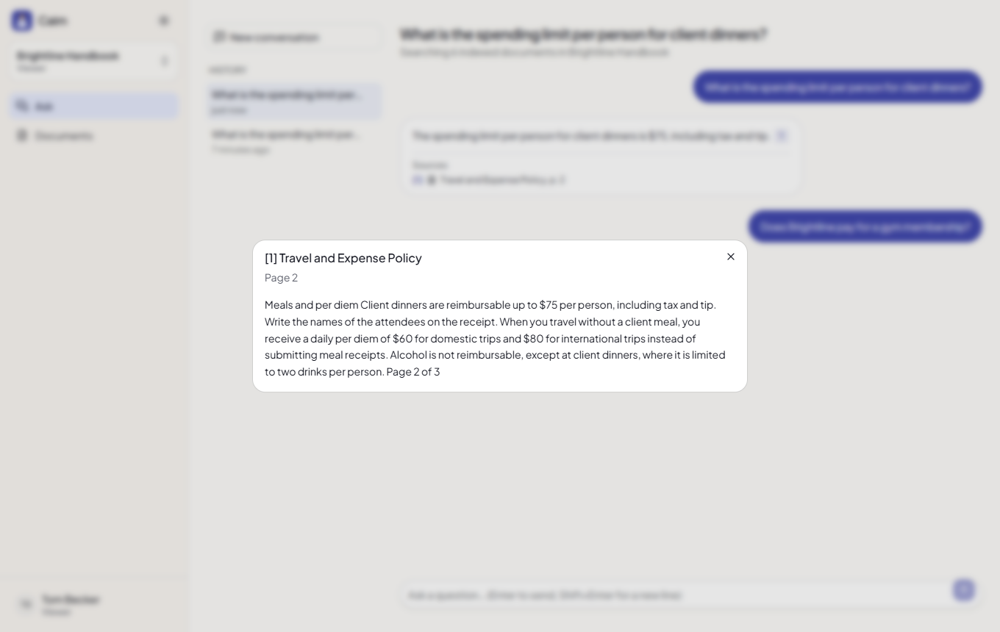
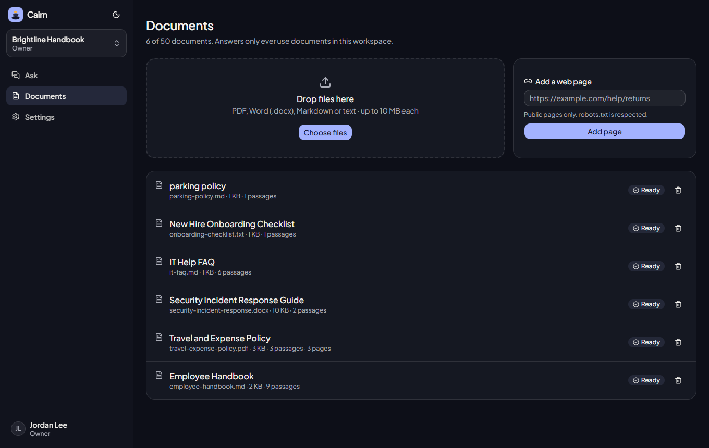
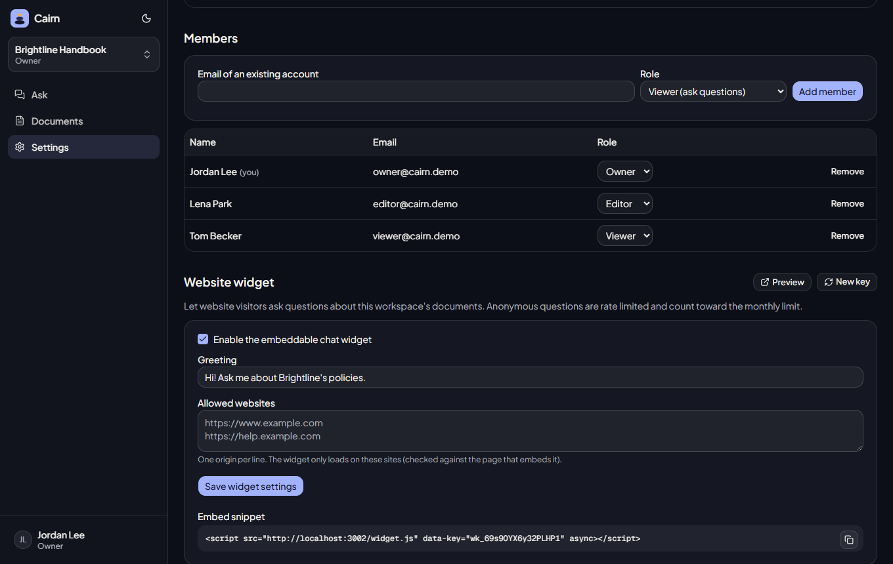
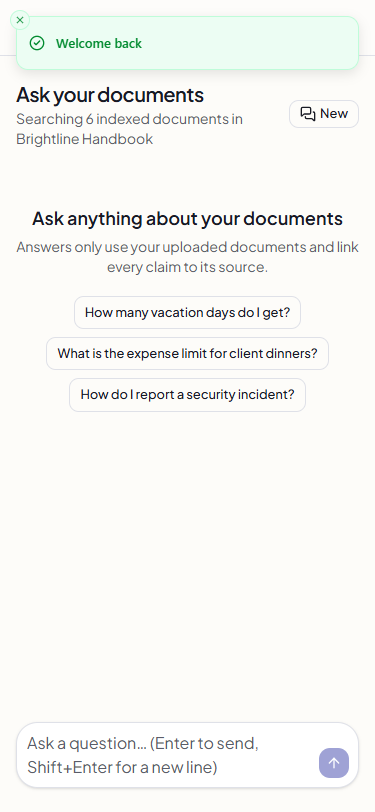
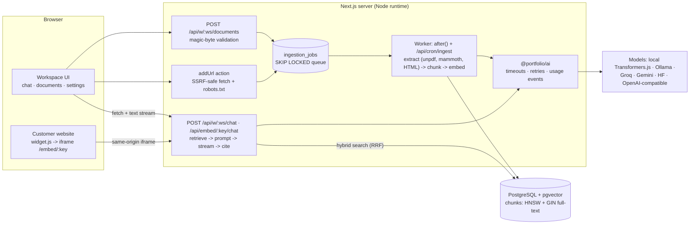

# Cairn — chat with your documents

**Upload PDFs, Word files, Markdown or web pages and get answers built only from them, with every claim linked to the exact passage and page — plus an embeddable website widget.**



> Portfolio project. The "Brightline Studio" documents are fictional **seed data** written for this demo.
> AI answers in the screenshots came from real calls to a local open model (`Qwen2.5-1.5B-Instruct`), not mock-ups.

## Contents
[Features](#features) · [Screenshots](#screenshots) · [Quickstart](#quickstart) · [Demo logins](#demo-logins) ·
[Architecture](#architecture) · [Data model](#data-model) · [AI design](#ai-design) · [Quality metrics](#quality-metrics) ·
[Security](#security-notes) · [Tech stack](#tech-stack) · [Environment variables](#environment-variables) ·
[Limitations](#limitations) · [Licenses](#licenses) · [Extending for a client](#how-i-would-extend-this-for-a-client)

## Features
- **Workspaces** with owner / editor / viewer roles; documents and conversations never cross workspaces.
- **Uploads**: PDF, DOCX, Markdown and plain text (up to 10 MB each, 10 per batch). The real type is checked from the file's bytes, not its extension or browser MIME type; names are sanitized; duplicates are detected by content hash.
- **Web pages**: add a public URL; fetching is SSRF-safe (private, loopback, link-local and metadata addresses blocked at connect time and for IP-literal URLs, every redirect re-checked), limited to 2 MB / 10 s, and robots.txt is respected.
- **Background ingestion**: a Postgres-backed job queue (`FOR UPDATE SKIP LOCKED`, retries with backoff, stale-lock recovery). Jobs run right after the upload response (`after()`) and via a cron endpoint; the documents page shows live status.
- **Hybrid retrieval**: pgvector cosine similarity + Postgres full-text search, merged with reciprocal rank fusion; passages keep their page number and section heading.
- **Grounded, streamed answers** with numbered citations that open the exact passage. If nothing relevant is found, Cairn says so **without calling the model**.
- **Conversation history** with follow-up questions.
- **Usage limits**: monthly questions and document caps per workspace, per-user and per-visitor rate limits, AI usage dashboard.
- **Embeddable widget**: `<script src=".../widget.js" data-key="...">` adds a help chat to any allowlisted website.

## Screenshots
Captured with Playwright from the running app (`npm run screenshots`).

| Citation opens the exact passage | Documents with live status (dark) |
|---|---|
|  |  |
| **Widget settings + embed snippet (dark)** | **Mobile (375 px)** |
|  |  |

## Quickstart
Requirements: Node 22+. No Docker, database server or API key needed.

```bash
npm install                               # from the repository root
npm run setup --workspace apps/kb-chat    # migrate + seed + ingest the demo documents (embedded PGlite)
npm run dev --workspace apps/kb-chat      # http://localhost:3002
```

Answers need an AI provider: copy `apps/kb-chat/.env.example` to `.env` and set `AI_LOCAL_MODELS=true`
(free, in-process open models; ~1.7 GB one-time download) or a free-tier key (`GROQ_API_KEY`, `GEMINI_API_KEY`,
`HF_TOKEN`) or `OLLAMA_BASE_URL`. Re-run the seed afterwards so passages get embeddings (without an embeddings
provider the app still works with keyword search). With no provider the chat shows "AI unavailable".

**Postgres instead of PGlite:** `docker compose -f apps/kb-chat/docker-compose.yml up --build`.

## Demo logins
Seed data only; shared public password: **`demo-password-123`**

| Role | Email | Can |
|---|---|---|
| Owner | `owner@cairn.demo` | everything incl. members, widget, usage; also owns a second workspace (isolation demo) |
| Editor | `editor@cairn.demo` | upload / delete documents, ask, see usage |
| Viewer | `viewer@cairn.demo` | ask questions and read documents |

## Architecture


## Data model
```mermaid
erDiagram
  user ||--o{ workspace_members : "belongs to"
  workspaces ||--o{ workspace_members : has
  workspaces ||--o{ documents : contains
  documents ||--o| document_blobs : "raw upload (deleted after indexing)"
  documents ||--o{ chunks : "split into"
  documents ||--o{ ingestion_jobs : "processed by"
  workspaces ||--o{ conversations : has
  user ||--o{ conversations : "asks (null = widget visitor)"
  conversations ||--o{ messages : contains

  workspaces { uuid id PK; text slug UK; int monthly_question_limit; int max_documents; bool widget_enabled; text widget_key UK; text_array widget_allowed_origins }
  documents { uuid id PK; uuid workspace_id FK; text title; source_type source_type; text mime_type; text content_hash; document_status status; int chunk_count; int page_count }
  chunks { uuid id PK; uuid document_id FK; uuid workspace_id FK; int ordinal; text content; int page; text heading; vector_384 embedding }
  ingestion_jobs { uuid id PK; uuid document_id FK; job_status status; int attempts; timestamptz locked_at; timestamptz run_after }
  messages { uuid id PK; uuid conversation_id FK; message_role role; text content; message_status status; jsonb citations }
```
Plus Better Auth tables, `rate_limits` and `ai_usage`. Indexes: HNSW (`vector_cosine_ops`) and a GIN full-text
index on `chunks`, `(document_id, ordinal)`, `(workspace_id, content_hash)` unique, `(status, run_after)` on jobs.
Migrations: [`drizzle/migrations`](drizzle/migrations).

## AI design
**Pipeline.** Text is extracted per page (unpdf for PDF, mammoth for DOCX, an HTML-to-text pass that drops scripts
and page chrome for URLs), split along paragraphs into ~900-character passages with 150 characters of overlap,
prefixed with their section heading, and embedded with `all-MiniLM-L6-v2` (384 dims). At question time the 5 best
passages from vector + keyword search (fused with RRF) become numbered sources.

**Prompt.** [`rag/core.ts`](src/server/rag/core.ts): answer only from the sources, cite `[n]` after each claim, otherwise
reply exactly "I couldn't find this in the documents."; deterministic decoding (temperature 0); max 350 output tokens.

**Citations.** `[n]` markers written by the model are mapped to stored passages. Small models often answer correctly
but drop the markers; in that case each answer sentence is matched to the passage containing ≥60% of its content
words, and those citations are stored with `method: "matched"` — the UI says they were matched automatically.

**Safety and cost controls**
- No relevant passage (cosine similarity below 0.3) → refusal **without a model call**.
- Sources, the question and conversation history are wrapped in `<untrusted_*>` fences the content cannot close; the model has no tools and can't trigger actions.
- Every query is scoped to one workspace in SQL; the eval includes a question whose answer exists only in another workspace.
- Input capped at 16,000 characters (passages truncated to 1,400 each), output at 350 tokens; 60 s timeout; retries with backoff.
- Rate limits (Postgres-backed): 20 questions/min per user, 6/min per widget visitor IP plus 60/min per widget; monthly question limit per workspace.
- Every model and embedding call is logged to `ai_usage`.

## Quality metrics
Every number comes from a command that was run; raw output in [docs/verification.md](docs/verification.md).

| Metric | Result | Source |
|---|---|---|
| Unit + integration tests | 54 passed | `npm run test:coverage` (Vitest, in-memory PGlite, real parsers) |
| Line coverage (server + lib) | 87.75% | same run → [`docs/metrics/coverage-summary.json`](docs/metrics/coverage-summary.json) |
| End-to-end tests | 15 passed (ask + cite, refusal, upload → indexed → cited, RBAC, widget allowlist, a11y, 360 px) | `npm run test:e2e` (Playwright, production build) |
| Accessibility (axe-core, WCAG 2 A/AA) | 0 violations on 5 pages, light + dark | `tests/e2e/journey.spec.ts` |
| Lighthouse — landing (mobile) | Performance 95 · Accessibility 100 · Best practices 100 · SEO 100 | [`docs/metrics/lighthouse-landing.json`](docs/metrics/lighthouse-landing.json) |
| Lighthouse — chat, signed in (mobile) | Performance 92 · Accessibility 100 · Best practices 100 · SEO 100 | [`docs/metrics/lighthouse-chat.json`](docs/metrics/lighthouse-chat.json) |
| RAG eval: retrieval hit@5 | 100% (17/17) | `npm run eval` → [`docs/metrics/eval-rag.json`](docs/metrics/eval-rag.json) |
| RAG eval: answer contains the key fact | 100% (17/17) | same |
| RAG eval: cites the correct document | 88.2% (15/17), of which 47.1% written by the model | same |
| RAG eval: citations to a wrong document | 0 | same |
| RAG eval: out-of-scope questions refused | 5/5 (incl. one answerable only from another workspace) | same |
| RAG eval: in-scope questions wrongly refused | 0% | same |
| Answer latency (local CPU model) | 13.5 s average | same; Qwen2.5-1.5B q4 on an i7-11370H |
| Ingestion of the 6 seed documents (4 formats, 22 passages, local embeddings) | 5.3 s | `npm run db:seed` |
| Production dependency audit | 0 vulnerabilities | `npm audit --omit=dev` |

The first eval run (no attribution, sampling at temperature 0.1) scored 47.1% on citations; a prompt with a
worked example raised citations to 70.6% but dropped fact accuracy to 76.5%, so it was reverted in favor of
labeled attribution + deterministic decoding. All runs are kept in `docs/metrics/`. 22 cases is a small sample.

## Security notes
- Authorization on every route handler and server action via one RBAC matrix ([`permissions.ts`](src/server/permissions.ts)); non-members get 404s.
- Upload validation by magic bytes + extension agreement, UTF-8 check for text, size and count limits, sanitized names. Raw uploads are deleted after indexing.
- URL ingestion: http/https only, no credentials, ports 80/443, private/loopback/link-local/metadata IPs blocked at DNS-lookup time (DNS-rebinding safe) **and** for IP-literal hosts — a test caught that IP literals bypassed the lookup hook, now fixed with regression tests.
- Widget: disabled by default, public key rotatable, iframe only renders when the embedding page's origin (Referer) is allowlisted; `/embed/*` is the only frameable path.
- CSRF: server actions use Next's Origin check; streaming/upload routes call `assertSameOrigin`.
- Cron endpoint requires `Authorization: Bearer $CRON_SECRET` (constant-time compare).
- Passwords hashed with scrypt; sign-in limited to 5/min per IP; security headers (CSP, HSTS, nosniff, Referrer-Policy, Permissions-Policy).
- Errors return safe messages with a reference id; no stack traces.

## Tech stack
| Choice | Why |
|---|---|
| Next.js 16 App Router, React 19, TypeScript | streaming route handlers, server actions, `after()` for background work |
| PostgreSQL + pgvector (Drizzle) | vectors, full-text search and the job queue in one database |
| PGlite locally | real Postgres 18 + pgvector with zero setup; same migrations as production |
| unpdf, mammoth, node-html-parser | serverless-friendly parsers for PDF, DOCX and HTML |
| undici | connect-time DNS validation for SSRF-safe fetching |
| Transformers.js / hosted adapters | free local models by default, hosted providers optional |
| Vitest, Playwright, axe-core | integration tests on a real database, browser E2E and accessibility |

## Environment variables
| Variable | Required | Default | Purpose |
|---|---|---|---|
| `APP_URL` | prod | `http://localhost:3002` | base URL (auth callbacks, widget snippet) |
| `DATABASE_URL` | prod | empty → PGlite | Postgres connection string |
| `PGLITE_DIR` | no | `.data/pglite` | local embedded database folder |
| `BETTER_AUTH_SECRET` | prod | — | session signing secret |
| `GITHUB_CLIENT_ID` / `GITHUB_CLIENT_SECRET` | no | — | GitHub sign-in |
| `CRON_SECRET` | prod | — | bearer token for `/api/cron/ingest` (Vercel Cron sends it automatically) |
| `MAX_UPLOAD_MB` | no | `10` | per-file upload limit |
| `AI_PROVIDER`, `AI_LOCAL_MODELS`, `OLLAMA_*`, `GROQ_*`, `GEMINI_*`, `HF_TOKEN`, `OPENAI_*`, `AI_EMBED_PROVIDER`, `AI_TIMEOUT_MS` | no | `auto` | AI providers (see [`.env.example`](.env.example)) |
| `AI_USER_PER_MINUTE` | no | `20` | questions per user per minute |
| `WIDGET_PER_MINUTE` | no | `6` | widget questions per visitor IP per minute |
| `AUTH_SIGNIN_PER_MINUTE` | no | `5` | sign-in attempts per IP per minute |
| `ALLOW_PRIVATE_URLS` | no | `false` | test-only escape hatch for private URL ingestion |

## Limitations
- The local 1.5B model is slow on CPU (13.5 s per answer) and often omits citation markers; those citations are matched automatically and labeled. A hosted model should cite more reliably, but that was not measured.
- Scanned PDFs (images without a text layer) are rejected — no OCR.
- Vercel's free plan runs cron jobs once a day; ingestion normally finishes in `after()`, and failed jobs retry on the next cron run.
- The widget's site check relies on the Referer header; a site that strips referrers can't embed it.
- Hosted provider adapters are tested against mocked HTTP only; Docker/compose and CI were written but not run on this machine.
- Members must already have an account to be added (no email invitations in this app).

## Licenses
| Asset | Source | License |
|---|---|---|
| Qwen2.5-1.5B-Instruct (ONNX) | huggingface.co/onnx-community/Qwen2.5-1.5B-Instruct | Apache-2.0 |
| all-MiniLM-L6-v2 | huggingface.co/Xenova/all-MiniLM-L6-v2 | Apache-2.0 |
| Plus Jakarta Sans, Geist Mono fonts | self-hosted from [`packages/ui/fonts`](../../packages/ui/fonts) (Fontsource 5.3.0 variable builds of the Google Fonts releases) via `next/font/local` | SIL Open Font License 1.1 |
| Lucide icons | lucide.dev | ISC |
| shadcn/ui components | ui.shadcn.com | MIT |
| Logo mark | drawn for this project (inline SVG) | same as this repo |
| Seed documents (Brightline Studio) | written for this project; fictional | same as this repo |

## How I would extend this for a client
- Connectors for where their knowledge lives: Google Drive, Notion, Confluence, SharePoint, Zendesk help center — with scheduled re-sync.
- OCR for scanned PDFs, table-aware chunking, and per-document access control (answers only from what each user may read).
- An evaluation set built from their real questions, run in CI before every prompt or model change.
- Widget theming, lead capture and hand-off to a human agent (email, Slack, helpdesk ticket).
- SSO, audit logs, data retention controls and EU hosting.
