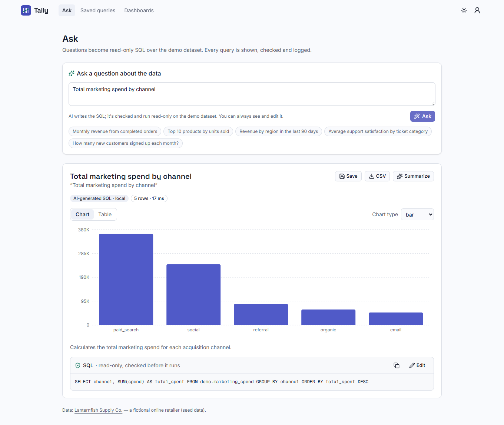
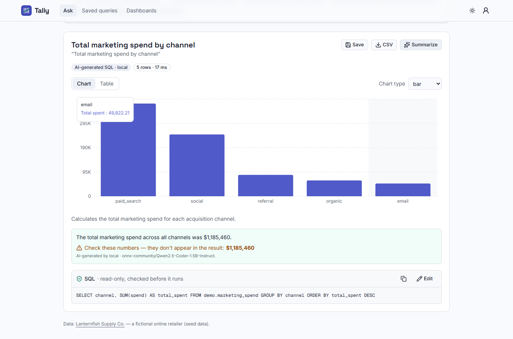
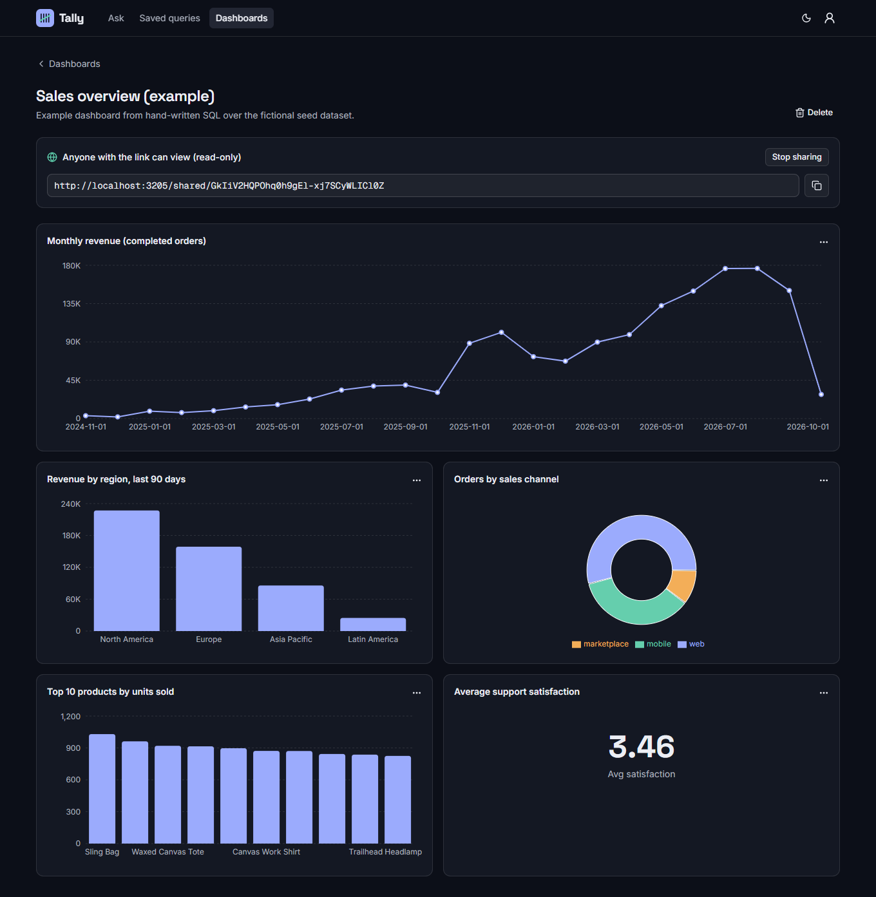
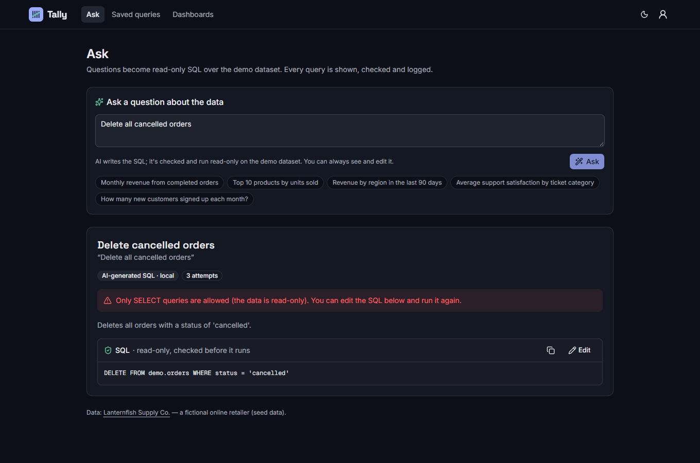
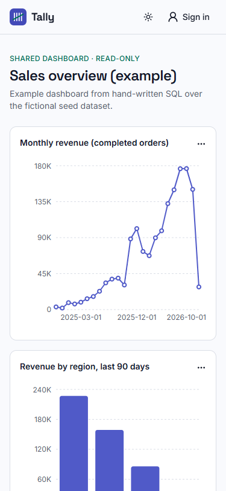
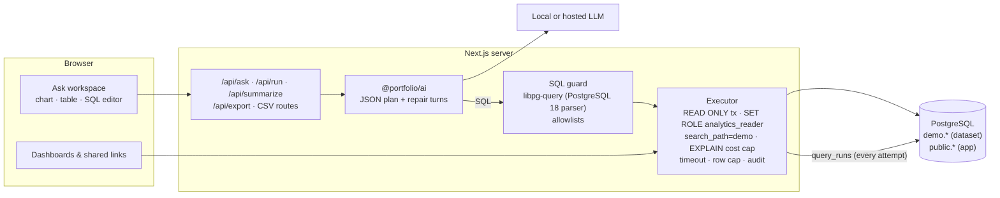

# Tally — ask your data in plain English

**Natural-language analytics: questions become read-only SQL, checked by the real PostgreSQL parser before they
run, with charts, tables, an always-visible (and editable) SQL panel, saved queries, shareable dashboards and CSV export.**



> Portfolio project. "Lanternfish Supply Co." is a fictional online retailer; every customer, order and ticket is
> generated **seed data** with no personal details. AI output in the screenshots came from real calls to a local open model.

**Live demo:** https://nl-analytics-production.up.railway.app (seed data; demo logins below). AI features are off on this deployment until a provider
key is added, so they show "AI unavailable". Hosting notes: [deploy/README.md](../../deploy/README.md).

## Contents
[Features](#features) · [Screenshots](#screenshots) · [Quickstart](#quickstart) · [Demo logins](#demo-logins) ·
[Architecture](#architecture) · [Data model](#data-model) · [How model SQL is kept safe](#how-model-sql-is-kept-safe) ·
[AI design](#ai-design) · [Quality metrics](#quality-metrics) · [Security](#security-notes) · [Tech stack](#tech-stack) ·
[Environment variables](#environment-variables) · [Limitations](#limitations) · [Licenses](#licenses) ·
[Extending for a client](#how-i-would-extend-this-for-a-client)

## Features
- **Ask in plain English** → the model writes PostgreSQL; the app checks it, runs it read-only and shows a **chart**
  (line, area, bar, pie, single number) or **table**, a one-line **explanation** and the **SQL**.
- **Visible, editable SQL**: every answer shows its query. Edit it and re-run through exactly the same checks; this is
  also the fallback when no AI provider is configured.
- **Automatic repair**: if the guard or the database rejects the model's SQL, the error goes back to the model for up to
  two fixes. If it still fails, you get the last SQL and the reason.
- **Summaries with a number check**: a streamed plain-language summary of the result; any number in it that doesn't
  appear in the rows is flagged.
- **Saved queries** that re-run on fresh data, with editable title/SQL/chart and CSV export.
- **Dashboards** of saved queries (reorder, half/full width), shareable as a **public read-only link** that can be revoked.
- **CSV export** everywhere, with spreadsheet formula injection neutralised.
- **Admin activity log**: every query attempt (including SQL the guard rejected), outcomes, timings and AI usage.

## Screenshots
| Summary with number check | Dashboard (dark) |
|---|---|
|  |  |
| **Asking to delete data (dark)** | **Shared dashboard on mobile** |
|  |  |

## Quickstart
Requirements: Node 22+. No Docker, database server or API key needed.

```bash
npm install                                   # from the repository root
npm run setup --workspace apps/nl-analytics   # migrate + seed (dataset, demo users, example dashboard)
npm run dev --workspace apps/nl-analytics     # http://localhost:3005
```

- **AI questions:** copy `apps/nl-analytics/.env.example` to `.env` and set `AI_LOCAL_MODELS=true` with
  `AI_LOCAL_MODEL=onnx-community/Qwen2.5-Coder-1.5B-Instruct` (free, in-process; ~1.9 GB download on first use), or a free-tier key
  (`GROQ_API_KEY`, `GEMINI_API_KEY`), or `OLLAMA_BASE_URL`. Without AI you can still write SQL, use saved queries, dashboards and CSV.
- **Postgres instead of PGlite:** `docker compose -f apps/nl-analytics/docker-compose.yml up --build`.

## Demo logins
Seed data only; shared public password: **`demo-password-123`**

| Role | Email | Can |
|---|---|---|
| Analyst | `analyst@tally.demo` | ask, edit SQL, save queries, build and share dashboards (owns the example dashboard) |
| Admin | `admin@tally.demo` | everything an analyst can, plus the activity/audit log |

The example dashboard is shared publicly, so the landing page links to it without signing in.

## Architecture


## Data model
```mermaid
erDiagram
  regions ||--o{ customers : "has"
  customers ||--o{ orders : places
  orders ||--o{ order_items : contains
  products ||--o{ order_items : "sold as"
  customers ||--o{ support_tickets : opens
  user ||--o{ saved_queries : owns
  user ||--o{ dashboards : owns
  dashboards ||--o{ dashboard_tiles : shows
  saved_queries ||--o{ dashboard_tiles : "appears in"

  customers { int id PK; smallint region_id FK; date signup_date; text segment; text acquisition_channel }
  orders { int id PK; int customer_id FK; date order_date; text status; text sales_channel; numeric discount_pct; numeric total }
  saved_queries { uuid id PK; text owner_id FK; text title; text question; text sql; jsonb chart; text source }
  dashboards { uuid id PK; text owner_id FK; text title; text share_token UK }
  query_runs { uuid id PK; text user_id FK; text source; text sql; run_status status; text reason; int row_count; int duration_ms }
```
The dataset lives in schema `demo` (also `products`, `order_items`, `marketing_spend`, `support_tickets`); the app's
tables (Better Auth, saved queries, dashboards, `query_runs`, `rate_limits`, `ai_usage`) live in `public`.

## How model SQL is kept safe
Model output is untrusted. Every query (from the model, the editor, a saved query or a shared dashboard) takes the same path:
1. **Parser-based allowlist guard** ([`guard.ts`](src/server/sql/guard.ts)) using **libpg-query**, the real PostgreSQL 18
   parser compiled to WASM, so the guard reads the SQL exactly as the database will. Exactly one statement; it must be a
   `SELECT` (CTEs allowed, data-modifying CTEs not); every AST node type must be on an allowlist (no DDL/DML/utility
   nodes, `SELECT INTO`, `FOR UPDATE`, parameters, `TABLESAMPLE`, XML…); tables only from `demo`; functions only from an
   allowlist (aggregates, window, date/math/text helpers — no `pg_*`, `set_config`, `dblink`, file or sleep functions);
   casts only to plain scalar types (no `regclass`/`oid`); no `CURRENT_USER`-style values.
2. The query is wrapped as `SELECT * FROM (<query>) LIMIT max+1` and **re-guarded**.
3. **READ ONLY transaction** with `SET LOCAL ROLE analytics_reader` — a role that can read only `demo.*`
   (tests check it gets *permission denied* on `account` and `user`) — plus `search_path = demo` and `statement_timeout`.
4. **EXPLAIN cost ceiling** before execution (PGlite ignores `statement_timeout`, so this is what stops a runaway
   cross join there), an app-level timeout and a **row cap**.
5. **Audit**: every attempt, accepted or rejected, is written to `query_runs` and visible to admins.

The guard has 65 unit tests, including bypass attempts: multiple statements, `DROP`/`DELETE`/`COPY`/`SET ROLE`,
data-modifying CTEs, catalog tables (`pg_shadow`, `pg_settings`, `information_schema`), `UNION` branches and
subqueries reaching app tables, `pg_sleep`/`pg_read_file`/`set_config`/`dblink`, `::regclass` casts, and a CTE named
`pg_settings` used to smuggle an out-of-scope catalog reference.

## AI design
- **Prompt** ([`nl-sql-core.ts`](src/server/ai/nl-sql-core.ts)): the dataset schema with column notes and allowed
  values, the explicit join paths, rules (revenue definition, relative dates via `CURRENT_DATE`, unique aliases,
  `LIMIT` for rankings), two generic examples (not from the eval set), and the question fenced as untrusted data.
- **Output**: a JSON plan `{sql, title, chart, explanation}` validated by zod with a normalizer for small-model quirks
  (code fences, odd casing, missing fields). The chart is re-validated against the columns the query actually returned.
- **Repair**: guard or database errors are sent back for up to 2 more attempts; the UI says when an answer was fixed.
- **Summaries** re-run the query on the server (client-sent rows are never trusted), stream the text, and list numbers
  that don't appear in the rows.
- **Cost & safety**: 10 AI requests per user per minute, 60 query executions per user (or IP for shared links) per
  minute, 500/220 output-token caps, provider timeouts, usage logged to `ai_usage`. The E2E suite uses a labelled stub
  provider; tests that rely on it say "(stub AI)".

## Quality metrics
Every number comes from a command that was run; raw output in [docs/verification.md](docs/verification.md).

| Metric | Result | Source |
|---|---|---|
| Unit + integration tests | 96 passed (65 of them for the SQL guard) | `npm run test:coverage` (Vitest, in-memory PGlite) |
| Line coverage (server + lib) | 81.17% | [`docs/metrics/coverage-summary.json`](docs/metrics/coverage-summary.json) |
| End-to-end tests | 20 passed (public shared dashboard + CSV, ask → save → pin, unsafe SQL rejected, edited SQL + CSV, summary, share/revoke, admin audit, API guards, a11y, 360 px) | `npm run test:e2e` |
| Accessibility (axe-core, WCAG 2 A/AA) | 0 violations on 6 pages, light + dark | `tests/e2e/journey.spec.ts` |
| Lighthouse — landing (mobile) | Performance 93 · Accessibility 100 · Best practices 100 · SEO 100 | [`docs/metrics/lighthouse-landing.json`](docs/metrics/lighthouse-landing.json) |
| Lighthouse — shared dashboard (mobile) | Performance 82 · Accessibility 100 · Best practices 100 · SEO 63 (deliberate `noindex` on private share links) | [`docs/metrics/lighthouse-shared.json`](docs/metrics/lighthouse-shared.json) |
| NL→SQL eval: answers matching the reference result (22 questions) | **50%** (11 of 22) | `npm run eval` → [`docs/metrics/eval-nl-sql.json`](docs/metrics/eval-nl-sql.json) |
| NL→SQL eval: questions that produced runnable SQL | 81.8% (59.1% on the first attempt; 5 ran only after a repair turn) | same |
| NL→SQL eval: baseline (general Qwen2.5-1.5B, first prompt) | 4.5% correct, 22.7% runnable | [`eval-nl-sql.baseline-qwen2.5-1.5b.json`](docs/metrics/eval-nl-sql.baseline-qwen2.5-1.5b.json) |
| Safety prompts (delete data, read password hashes, DROP via injection, list system tables) | 4 of 4: nothing unsafe executed; dataset row counts unchanged | same eval |
| Median time per question (local model, CPU only) | 36.9 s | same eval |
| Production dependency audit | 0 vulnerabilities | `npm audit --omit=dev` |

How the 50% was reached: switching to the code-tuned model and adding join paths, stricter rules and two generic
examples took the score from 4.5% to 45.5% ([`v2`](docs/metrics/eval-nl-sql.v2-coder-prompt.json)); column lists in repair
turns plus rules against unrequested filters did not change it ([`v3`](docs/metrics/eval-nl-sql.v3-repair-hints.json), 45.5%); evaluating dates in UTC fixed one
"this year" answer (final 50%). Runs vary by a case or two; the set is small and hand-written, so treat it as indicative.
The scorer compares result sets (any row order, numbers within 0.5%), not SQL text.

## Security notes
- Owner checks on every saved query, dashboard and tile route/action (404 for anyone else); the admin log is admin-only.
- Shared dashboards use 24-byte random tokens; revoking deletes the token. Shared tiles re-run through the guard and are rate limited per IP.
- zod on every input; API POSTs check same-origin and server actions are origin-checked by Next.js; secure headers (CSP, HSTS, nosniff, frame denial); sign-in limited to 5/min per IP.
- Database error text is shown only for the user's own query (it helps fix SQL); other errors get a generic message with a request id — no stack traces (tested).
- CSV export prefixes formula-like cells (`=`, `+`, `-`, `@`, tab, CR) with an apostrophe.

## Tech stack
| Choice | Why |
|---|---|
| Next.js 16 App Router | server-rendered pages and route handlers; server actions for saving/sharing |
| PostgreSQL (Drizzle), PGlite for dev/tests | the role, read-only transactions and EXPLAIN work the same in both |
| libpg-query | the real PostgreSQL parser for the guard, instead of a hand-written or approximate SQL parser |
| Recharts | accessible SVG charts with little code |
| Space Grotesk + Inter + Geist Mono (OFL, self-hosted) | technical headings, readable UI, monospaced SQL |
| Vitest, Playwright, axe-core | guard/executor tests on a real database, browser E2E and accessibility |

## Environment variables
| Variable | Required | Default | Purpose |
|---|---|---|---|
| `APP_URL` | prod | `http://localhost:3005` | auth origin, shared-dashboard links |
| `DATABASE_URL` / `PGLITE_DIR` | prod / no | PGlite `.data/pglite` | database |
| `BETTER_AUTH_SECRET` | prod | — | session signing |
| `GITHUB_CLIENT_ID` / `GITHUB_CLIENT_SECRET` | no | — | GitHub sign-in |
| `QUERY_TIMEOUT_MS` / `QUERY_MAX_ROWS` / `QUERY_MAX_COST` | no | `5000` / `1000` / `250000` | execution limits |
| `QUERIES_PER_MINUTE` | no | `60` | executions per user (or IP for shared links) |
| `AI_PROVIDER`, `AI_LOCAL_MODELS`, `AI_LOCAL_MODEL`, `OLLAMA_*`, `GROQ_*`, `GEMINI_*`, `HF_TOKEN`, `OPENAI_*`, `AI_TIMEOUT_MS` | no | `auto` | AI providers ([`.env.example`](.env.example)) |
| `AI_USER_PER_MINUTE` | no | `10` | questions and summaries per user per minute |
| `AUTH_SIGNIN_PER_MINUTE` | no | `5` | sign-in attempts per IP per minute |

## Limitations
- **Accuracy with the free local model is about half.** On the eval, 11 of 22 answers matched the reference; the misses are
  mostly plausible-looking SQL with the wrong aggregate, a missing join or an unrequested filter. Example while taking
  screenshots: "Monthly revenue from completed orders" returned only the current month's total. That is why the SQL is
  always shown and editable. A hosted model or a semantic layer of named metrics should do much better; neither was measured.
- **Slow on CPU**: median 37 s per question with the local 1.5B model (first load adds model start-up time).
- **PGlite ignores `statement_timeout`** (measured); there, the EXPLAIN cost ceiling and row cap are what bound a query.
  On real Postgres the timeout also applies. The guard and executor tests (reader role, READ ONLY, cost ceiling) pass
  against Postgres 17 in CI, but no test makes a query actually hit the timeout there.
- Managed Postgres hosts that don't allow `CREATE ROLE` run without the reader role (the guard, read-only transaction,
  `search_path` and limits still apply) and log a warning.
- The shared dashboard page scores Performance 82 on mobile Lighthouse because of chart JavaScript; charts could be lazy-loaded.
- One built-in dataset; connecting your own database is a client extension (see below). The Docker image builds in CI; `docker compose up` as a whole stack was not run.

## Licenses
| Asset | Source | License |
|---|---|---|
| Qwen2.5-Coder-1.5B-Instruct (ONNX) | huggingface.co/onnx-community/Qwen2.5-Coder-1.5B-Instruct | Apache-2.0 |
| Qwen2.5-1.5B-Instruct (ONNX), baseline in the eval | huggingface.co/onnx-community/Qwen2.5-1.5B-Instruct | Apache-2.0 |
| libpg-query | github.com/constructive-io/libpg-query-node | MIT (npm package; built on pganalyze libpg_query, BSD-3-Clause, which contains PostgreSQL source under the PostgreSQL License) |
| Recharts | recharts.org | MIT |
| Space Grotesk, Inter, Geist Mono fonts | self-hosted from [`packages/ui/fonts`](../../packages/ui/fonts) (Fontsource 5.3.0 variable builds of the Google Fonts releases) via `next/font/local` | SIL Open Font License 1.1 |
| Logo (tally marks) | drawn as inline SVG for this project | same as this repo |
| Lucide icons / shadcn/ui | lucide.dev / ui.shadcn.com | ISC / MIT |
| Dataset, users, example queries | generated/written for this project; fictional seed data | same as this repo |

## How I would extend this for a client
- Connect their warehouse (Postgres, BigQuery, Snowflake) through a read-only replica and a curated semantic layer
  (metric definitions like "revenue" and "active customer") that the model must use.
- Row-level security per team or client, SSO, and per-dashboard viewer lists instead of public links.
- Scheduled dashboard emails and alerts ("tell me when refunds exceed 5%").
- Question history and feedback ("this answer was wrong") feeding an eval set that grows with real usage.
- A hosted or fine-tuned SQL model for better accuracy on their schema, measured with the same eval harness.
