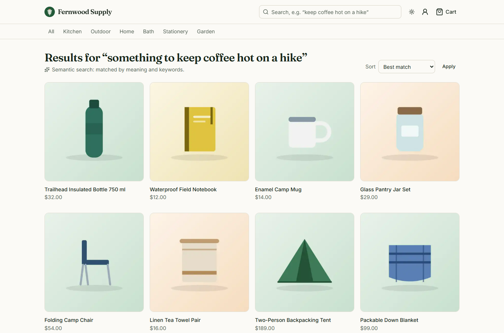
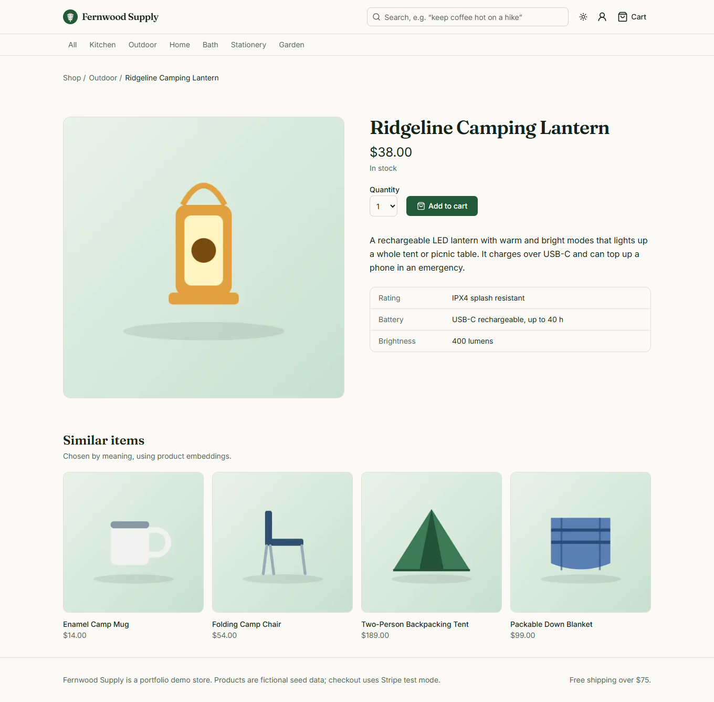
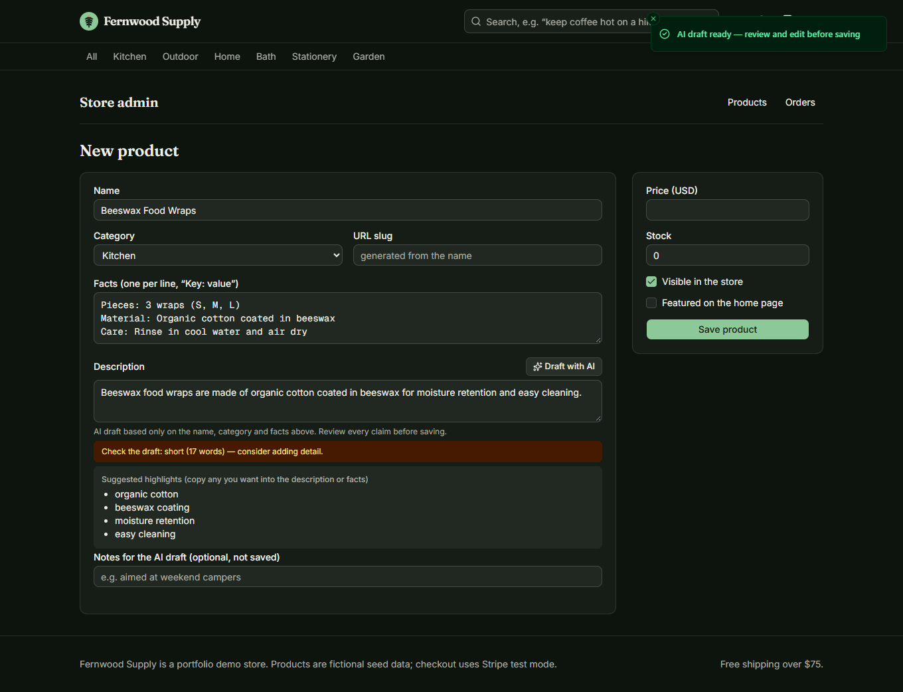
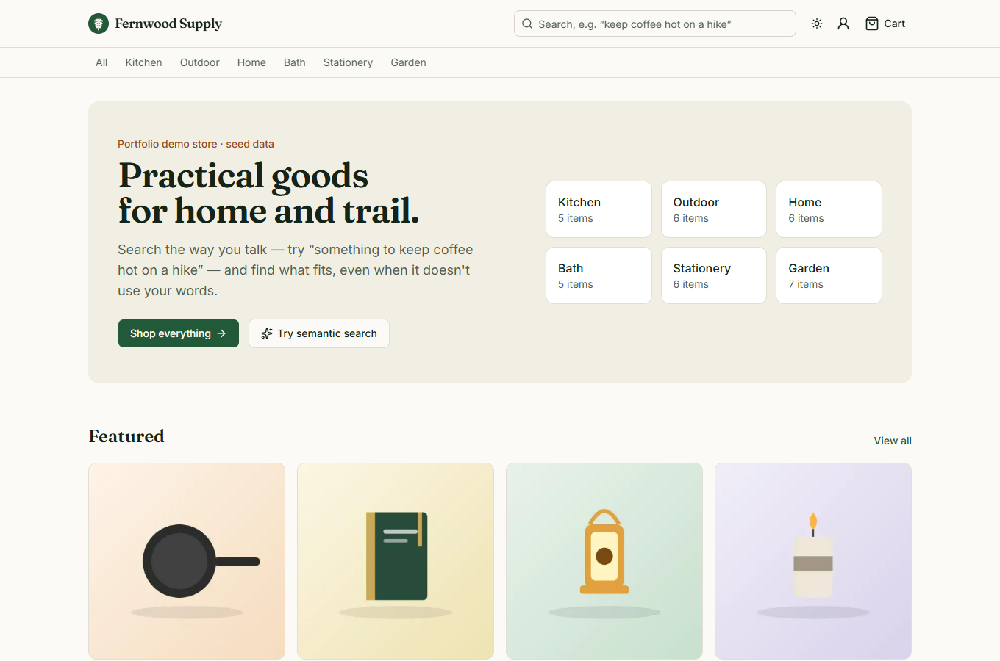
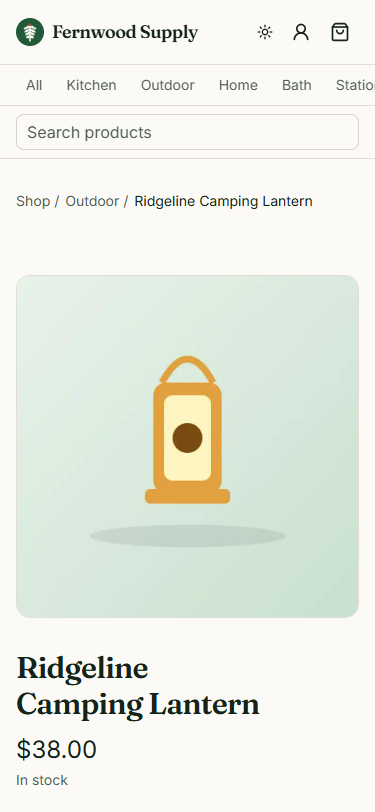
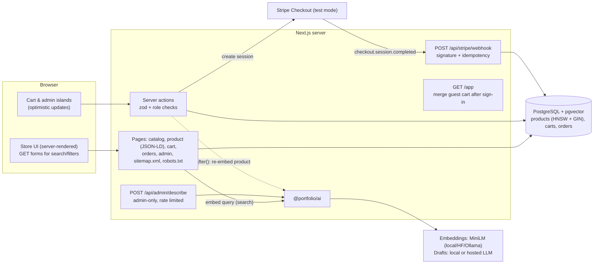

# Fernwood Supply — e-commerce storefront with semantic search

**A complete online store: catalog, cart, Stripe checkout (test mode) with signed webhooks, order history and an admin panel — plus search that understands what shoppers mean, AI-drafted product descriptions and "similar items".**



> Portfolio project. Products, prices, people and orders are fictional **seed data**; product images are original
> illustrations generated by the seed script. The AI draft in the admin screenshot came from a real call to a local
> open model (`Qwen2.5-1.5B-Instruct`).

## Contents
[Features](#features) · [Screenshots](#screenshots) · [Quickstart](#quickstart) · [Demo logins](#demo-logins) ·
[Architecture](#architecture) · [Data model](#data-model) · [AI design](#ai-design) · [Quality metrics](#quality-metrics) ·
[Security](#security-notes) · [Tech stack](#tech-stack) · [Environment variables](#environment-variables) ·
[Limitations](#limitations) · [Licenses](#licenses) · [Extending for a client](#how-i-would-extend-this-for-a-client)

## Features
**Store**
- Catalog with 6 categories, sorting, pagination and product pages with facts tables; sold-out states.
- Cart for guests (httpOnly cookie) that merges into the account cart at sign-in; optimistic quantity updates that roll back if the server refuses (stock, limits).
- **Stripe Checkout in test mode**: prices and stock are re-checked on the server, the order is stored with the Stripe session, and it becomes *paid* only via a signed, idempotent webhook that decrements stock with a guarded update (never negative) and empties the cart. Expired sessions cancel the order; refunds are recorded.
- Order history and order detail for customers; flat shipping with a free-shipping threshold.
- **SEO**: per-page metadata, canonical URLs, Open Graph images, `sitemap.xml`, `robots.txt`, schema.org `Product` JSON-LD with price and availability; optimized images via `next/image`.

**Admin** (role stored on the user, not settable at sign-up)
- Products list, create/edit (price, stock, visibility, featured, facts), orders list with status filters and "mark shipped".

**AI features**
- **Semantic search** — shopper queries are embedded and matched by meaning (pgvector), fused with keyword search; falls back to keywords when embeddings are unavailable or a visitor exceeds the search rate limit, and says so on the page.
- **Similar items** — nearest neighbours by product embedding, in-stock first; category fallback.
- **AI product descriptions for admins** — a structured draft from the name, category and facts only; rules (no prices, shipping claims or superlatives) are enforced by the output schema with automatic repair turns; the admin edits before saving, and the product records that its description came from an edited AI draft.

## Screenshots
| Product page with similar items | Admin: AI description draft (dark) |
|---|---|
|  |  |
| **Home** | **Mobile (375 px)** |
|  |  |

## Quickstart
Requirements: Node 22+. No Docker, database server, API key or Stripe account needed to browse.

```bash
npm install                                  # from the repository root
npm run setup --workspace apps/storefront    # migrate + seed (also renders product images)
npm run dev --workspace apps/storefront      # http://localhost:3003
```

- **Semantic search / AI drafts:** copy `apps/storefront/.env.example` to `.env`, set `AI_LOCAL_MODELS=true` (free, in-process open models) or a free-tier key, and re-run `npm run db:seed --workspace apps/storefront` to embed the catalog. Without embeddings, search uses keywords and says so.
- **Checkout:** add Stripe **test** keys (`STRIPE_SECRET_KEY=sk_test_…`) and run `stripe listen --forward-to localhost:3003/api/stripe/webhook` to get `STRIPE_WEBHOOK_SECRET`. Pay with card `4242 4242 4242 4242`. Without keys the cart shows "Payments are not configured".
- **Postgres instead of PGlite:** `docker compose -f apps/storefront/docker-compose.yml up --build`.

## Demo logins
Seed data only; shared public password: **`demo-password-123`**

| Role | Email | Can |
|---|---|---|
| Admin | `admin@fernwood.demo` | everything a customer can, plus `/admin` (products, orders, AI drafts) |
| Customer | `customer@fernwood.demo` | shop, check out, see 2 example past orders (seed data) |

## Architecture


## Data model
```mermaid
erDiagram
  user ||--o{ carts : owns
  carts ||--o{ cart_items : contains
  products ||--o{ cart_items : "in"
  user ||--o{ orders : places
  orders ||--o{ order_items : contains
  products ||--o{ order_items : "snapshot of"

  user { text id PK; text email UK; text role }
  products { uuid id PK; text slug UK; text name; text description; description_source description_source; text category; int price_cents; int stock; bool active; bool featured; jsonb attributes; vector_384 embedding }
  carts { uuid id PK; text user_id FK }
  cart_items { uuid cart_id PK; uuid product_id PK; int quantity }
  orders { uuid id PK; int number UK; text user_id FK; order_status status; int total_cents; text stripe_session_id UK; text stripe_payment_intent_id }
  order_items { uuid id PK; uuid order_id FK; uuid product_id FK; text name; int unit_price_cents; int quantity }
```
Plus Better Auth tables, `stripe_events` (webhook idempotency), `rate_limits`, `ai_usage`. Database checks keep
prices positive, stock non-negative and cart quantities between 1 and 20. Order items snapshot name and price so later
edits don't rewrite history. Indexes: HNSW on embeddings, GIN full-text on name+category+description,
`(active, category)`, `(user_id, created_at)` on orders.

## AI design
- **Embeddings:** `all-MiniLM-L6-v2` (384 dims) of "name. Category: … description". Recomputed in `after()` whenever an admin edits product text.
- **Search ranking:** pgvector cosine search (similarity ≥ 0.25) + Postgres full-text, fused with reciprocal rank fusion ([`catalog.ts`](src/server/catalog.ts)). Each search embeds the query, so it is rate limited per IP (60/min) — beyond that the page silently uses keywords and tells the visitor.
- **Description drafts** ([`description-core.ts`](src/server/ai/description-core.ts)): only the name, category and admin-entered facts (and optional notes) go into the prompt, fenced as untrusted data with injection-looking sentences stripped. Output is JSON validated by zod; prices, shipping/discount claims and superlatives fail validation and trigger a repair turn; short drafts are flagged for the reviewer. The draft is only placed in the editor — saving is a separate human action.
- **Cost & safety:** admin drafts limited to 10/min per admin; 60 s timeout; output capped at 400 tokens; every call logged to `ai_usage`.

## Quality metrics
Every number comes from a command that was run; raw output in [docs/verification.md](docs/verification.md).

| Metric | Result | Source |
|---|---|---|
| Unit + integration tests | 22 passed | `npm run test:coverage` (Vitest, in-memory PGlite) |
| Line coverage (server + lib) | 79.12% | [`docs/metrics/coverage-summary.json`](docs/metrics/coverage-summary.json) |
| End-to-end tests | 14 passed (search → cart → sign-in merge, orders, admin draft → publish, SEO, a11y, 360 px) | `npm run test:e2e` |
| Accessibility (axe-core, WCAG 2 A/AA) | 0 violations on 5 pages, light + dark | `tests/e2e/journey.spec.ts` |
| Lighthouse — home (mobile) | Performance 91 · Accessibility 100 · Best practices 100 · SEO 100 | [`docs/metrics/lighthouse-home.json`](docs/metrics/lighthouse-home.json) |
| Lighthouse — product page (mobile) | Performance 89 · Accessibility 100 · Best practices 100 · SEO 100 | [`docs/metrics/lighthouse-product.json`](docs/metrics/lighthouse-product.json) |
| Search eval: hit@3 (18 shopper queries) | keyword 88.9% · semantic 100% · hybrid (production) 100% | `npm run eval` → [`docs/metrics/eval-search.json`](docs/metrics/eval-search.json) |
| Search eval: MRR | keyword 0.844 · semantic 0.935 · hybrid 0.907 | same |
| Description eval: valid drafts (18 cases) | 83.3% (72.2% on first attempt) | `npm run eval:descriptions` → [`docs/metrics/eval-descriptions.json`](docs/metrics/eval-descriptions.json) |
| Description eval: drafts with prices/shipping/superlatives | 0 of 14 valid drafts (baseline without schema rules: 8 of 15) | same + `eval-descriptions-baseline.json` |
| Description eval: facts mentioned | 81.1% on average | same |
| Description eval: drafts under 30 words | 11 of 14 valid drafts, median 22 words (flagged to the reviewer) | same |
| Description eval: injection attempts | 3: 2 rejected by validation, 1 clean draft; 0 injected content reached the editor | same |
| Production dependency audit | 0 vulnerabilities | `npm audit --omit=dev` |

Hybrid search keeps exact-name matching (useful for SKUs and brand words) at a small MRR cost versus pure semantic
ranking on this set. A stricter description schema (≥30 words) was tried and rejected: only 33.3% of drafts passed
([`eval-descriptions-strict.json`](docs/metrics/eval-descriptions-strict.json)). Small samples — indicative only.

## Security notes
- Role checks on every admin action and route (`requireAdmin*`); admin pages return 404 to non-admins. The `role` field can't be set through sign-up (`input: false`).
- Checkout re-validates the cart server-side (prices from the database, stock, active flags); the client never sends prices.
- Stripe: test keys only (live keys refused); webhook signature verified on the raw body; events processed once; guarded stock decrement; the Stripe session is created before the order row so failures leave no orphans.
- Cart cookie is httpOnly + SameSite=Lax; a cart that belongs to another account is never written through a copied cookie.
- Post-login redirects accept only same-site paths (tested with `//evil.example`).
- zod validation on all inputs; database CHECK constraints as a second line of defence; secure headers (CSP, HSTS, nosniff, frame denial); sign-in limited to 5/min per IP.

## Tech stack
| Choice | Why |
|---|---|
| Next.js 16 App Router | server-rendered catalog (fast, SEO-friendly), server actions for cart/admin, metadata/sitemap APIs |
| PostgreSQL + pgvector (Drizzle) | catalog, orders and vector search in one database; CHECK constraints for money/stock invariants |
| Stripe Checkout + webhooks | PCI scope stays with Stripe; webhook-driven state is the source of truth |
| sharp + inline SVG art | license-free product imagery generated at seed time, served as optimized WebP |
| Fraunces + Inter (Google Fonts, OFL) | distinctive serif headings with a readable UI face |
| Vitest, Playwright, axe-core | integration tests on a real database, browser E2E and accessibility |

## Environment variables
| Variable | Required | Default | Purpose |
|---|---|---|---|
| `APP_URL` | prod | `http://localhost:3003` | canonical URLs, sitemap, Stripe redirects |
| `DATABASE_URL` / `PGLITE_DIR` | prod / no | PGlite `.data/pglite` | database |
| `BETTER_AUTH_SECRET` | prod | — | session signing |
| `GITHUB_CLIENT_ID` / `GITHUB_CLIENT_SECRET` | no | — | GitHub sign-in |
| `STRIPE_SECRET_KEY` / `STRIPE_WEBHOOK_SECRET` | for checkout | — | test-mode payments |
| `SHIPPING_CENTS` / `FREE_SHIPPING_OVER_CENTS` | no | `800` / `7500` | shipping rules |
| `AI_PROVIDER`, `AI_LOCAL_MODELS`, `OLLAMA_*`, `GROQ_*`, `GEMINI_*`, `HF_TOKEN`, `OPENAI_*`, `AI_EMBED_PROVIDER`, `AI_TIMEOUT_MS` | no | `auto` | AI providers ([`.env.example`](.env.example)) |
| `AI_USER_PER_MINUTE` | no | `10` | admin AI drafts per minute |
| `SEARCH_PER_MINUTE` | no | `60` | semantic searches per IP per minute |
| `AUTH_SIGNIN_PER_MINUTE` | no | `5` | sign-in attempts per IP per minute |

## Limitations
- Live Stripe Checkout was not exercised on this machine (no Stripe account/keys); the webhook logic is tested with locally signed events, and the E2E suite checks the honest "Payments are not configured" state.
- The local 1.5B model writes short descriptions (median 22 words in the eval) and sometimes adds unsupported wording (e.g. "moisture retention" in the admin screenshot); the draft-only workflow and warnings exist for this reason. A hosted model would write better copy, but that was not measured.
- Mobile Lighthouse performance is 89–91 (LCP ~3.5 s under throttling) because pages are rendered per request (cart cookie in the header) and load two web fonts.
- No product image upload yet (new products get a category placeholder), no tax calculation, inventory reservation during checkout, or discount codes.
- Docker/compose and CI were written but not run on this machine.

## Licenses
| Asset | Source | License |
|---|---|---|
| Qwen2.5-1.5B-Instruct (ONNX) | huggingface.co/onnx-community/Qwen2.5-1.5B-Instruct | Apache-2.0 |
| all-MiniLM-L6-v2 | huggingface.co/Xenova/all-MiniLM-L6-v2 | Apache-2.0 |
| Fraunces, Inter, Geist Mono fonts | via `next/font/google` | SIL Open Font License 1.1 |
| Product illustrations, logo | generated/drawn for this project ([`drizzle/product-art.ts`](drizzle/product-art.ts)) | same as this repo |
| Lucide icons / shadcn/ui | lucide.dev / ui.shadcn.com | ISC / MIT |
| Catalog, orders | written for this project; fictional seed data | same as this repo |

## How I would extend this for a client
- Import their catalog (Shopify/WooCommerce CSV or API), real product photography with a CDN, and variants (size/color).
- Taxes (Stripe Tax), shipping rates from carriers, discount codes, inventory reservation during checkout, transactional emails.
- Search analytics ("searches with no results") feeding a synonym list and merchandising rules; personalized recommendations.
- AI copy in the brand's voice with a style guide and an approval workflow; bulk drafting for new collections.
- Headless option: keep the admin and API, render the storefront from their existing CMS.
